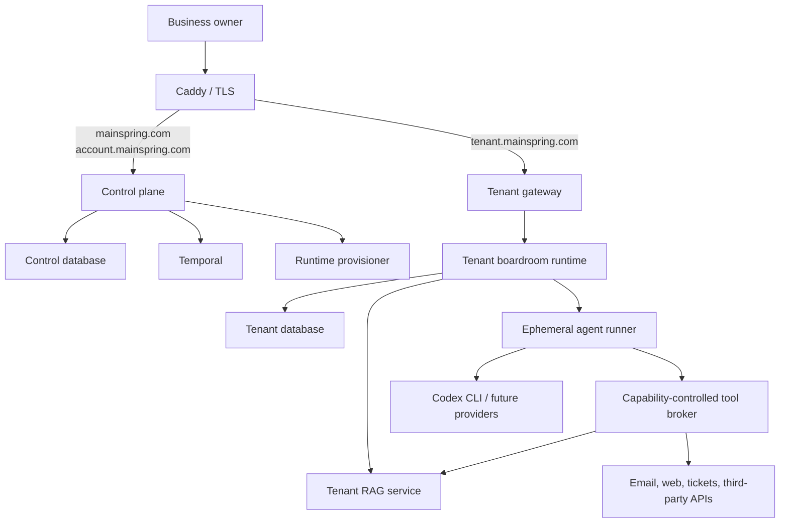

# Mainspring Engine Architecture

Status: Proposed for MVP  
Last updated: 2026-08-07

## Purpose

Mainspring Engine is a multi-tenant platform that gives a small business a persistent AI back office. A customer purchases a boardroom, signs in through a tenant-specific subdomain, and configures specialized personas that can deliberate, retrieve business knowledge, use approved tools, and run on schedules.

Tenant business templates specialize that experience without forking the runtime. The initial `trades` and `software` templates select onboarding language, persona catalogs, recommendations, and examples while retaining the same data isolation, orchestration, integrations, and authorization boundaries. The software template supports both product SaaS and managed-service-provider operating models; `saas` remains a configuration alias. The unified demo selects this template during onboarding instead of dedicating a hostname and runtime to each example.

The application, rather than an agent, owns boardroom orchestration. Models are replaceable execution providers that perform bounded turns inside an application-controlled workflow.

## Architectural principles

1. **The application owns orchestration.** Agents do not select or invoke other agents directly.
2. **Providers are replaceable.** Codex CLI is the MVP provider; Claude Code, OpenRouter, and other providers can be added without changing the domain model.
3. **Tenant identity is explicit.** Hostname, session, runtime, database credentials, tool grants, logs, and workflow identifiers must agree on the tenant.
4. **Control-plane data and tenant business data remain separate.** Billing and provisioning do not require access to customer documents, conversations, invoices, or integrations.
5. **Tools are capabilities, not prompt suggestions.** The Go harness enforces every tool grant and approval boundary.
6. **Work is durable.** Temporal records boardroom progress, schedules, retries, timers, and human approval waits.
7. **External effects are idempotent or reconciled.** A retry must not silently duplicate an email, invoice, payment, or integration mutation.
8. **Deployment is replaceable.** Docker Compose is the MVP runtime; Kubernetes can replace it through a runtime-provisioner interface.
9. **The MVP is simple, not disposable.** Advanced hardening may wait, but tenant isolation, secret handling, auditability, and recovery boundaries must be correct initially.

## System context



## Control plane

The control plane serves the public site and account area. It owns:

- Customer accounts used for purchasing and subscription management
- Plans, subscriptions, and billing references
- Tenant registry and subdomain reservation
- Runtime-host registry and tenant placement
- Provisioning, upgrade, suspension, and deletion requests
- Platform-level audit and operational status

The control plane does not receive tenant database credentials and does not directly query tenant business records.

## Tenant plane

Each purchased boardroom receives a tenant runtime reached through a unique subdomain. The tenant plane owns:

- Its own login and sessions
- Boardrooms, personas, prompts, and tool grants
- Typed agent provider settings, execution ceilings, behavior policies, and immutable versions
- Conversations, messages, runs, and approvals
- Documents, chunks, embeddings, and citations
- Schedules and boardroom configuration
- Integration references and tenant audit events
- The shared to-do and ticket work queue, including assignment and run provenance
- Invoices and other customer business records

The MVP provisions a boardroom container and a RAG container for each tenant. Both use tenant-specific database credentials. Agent invocations run in short-lived runner containers and do not receive database or Docker credentials.

## Persistence layout

The MVP uses one PostgreSQL server with separate physical databases and roles:

```text
mainspring_control
temporal
temporal_visibility
tenant_<immutable_uuid>
```

Each tenant database has a unique owner/role and enables pgvector. Customer-facing slugs are not used as database, role, container, or volume identifiers.

Temporal stores workflow history and coordination state. PostgreSQL tenant databases remain the source of truth for user-visible domain data. Large prompts, transcripts, files, and model outputs are referenced from Temporal rather than placed directly in workflow histories.

## Primary flows

### Purchase and provisioning

```text
Billing provider confirms purchase
  -> control plane records an idempotent billing event
  -> Temporal starts a tenant-provisioning workflow
  -> provisioner reserves an immutable tenant ID and subdomain
  -> provisioner creates tenant database and roles
  -> provisioner creates secrets, network, and storage
  -> migrations and seed data run
  -> RAG and boardroom containers start
  -> health checks pass
  -> tenant gateway route is registered
  -> one-time owner invitation is created
  -> tenant is marked ready
```

### Assisted onboarding

```text
Owner creates the tenant login
  -> owner selects trades, SaaS, MSP, or the new-business path in one tenant
  -> a new-business owner selects the closest industry context
  -> onboarding records both business template and operating/starting stage
  -> guided workflow collects canonical facts or clearly labeled launch assumptions
  -> onboarding assistant captures current processes or a proposed first operating playbook
  -> application generates an editable persona and permission blueprint
  -> owner keeps a lean core team and opts into bounded specialists as needed
  -> owner reviews and explicitly launches
  -> application validates and transactionally applies the profile, personas, and grants
  -> tenant request boundary opens the normal dashboard and boardrooms
```

The business-stage choice is independent of the tenant's industry template: a trade,
SaaS, or MSP tenant may be operating today or starting from scratch. The startup path
uses future-tense questions, launch-specific priorities, a lean `Launch Room`, and
persona instructions that explicitly treat processes, forecasts, customers, prices,
and dates as hypotheses until validated.

The onboarding assistant cannot mutate live personas or grant capabilities. It writes a
tenant-scoped structured draft; the application owns validation and application. New
tenants cannot access operational routes until onboarding is complete.

The trade catalog includes office management, bookkeeping, dispatch, legal and
compliance, market analysis, business development, website advising, customer experience, HR and
safety, estimating and job costing, and procurement. The software catalog includes operations,
revenue, customer success, product, engineering, reliability, growth, sales development,
UX research, website conversion, service delivery, technical account management, cloud and systems,
and security and compliance. Specialist roles are opt-in
unless the owner's stated priorities directly recommend one. Public-web research
and document commenting are separate launch permissions, and the boardroom turn
limit is set to the number of selected personas so no selected role is silently
skipped.

### Boardroom conversation and run

```text
User starts a conversation, follows up, or a schedule fires
  -> application creates or selects the persistent Conversation
  -> application creates one durable BoardroomRun for this round
  -> application snapshots ordered immutable persona versions and output schemas
  -> Temporal starts the versioned boardroom workflow
  -> one retryable Activity owns each idempotent persona turn
  -> tenant admission policy reserves concurrency, tokens, and estimated cost
  -> a short-lived constrained container invokes the selected provider
  -> tool requests pass through the signed capability broker and return bounded results
  -> structured results, usage, citations, proposals, and audit events are persisted atomically
  -> external proposals wait for an owner decision and execute through the action ledger
  -> application advances, waits for approval, or marks the round ready for follow-up
```

A boardroom is the long-lived team and workspace. A conversation is a continuing job,
question, or issue within that workspace. A run is one durable round of persona turns.
Recurring schedules create a new, dated conversation for each occurrence so reports do
not blend into one endless transcript. Historical `/runs/{id}` links resolve to the
conversation that owns the run.

### Agent customization

```text
Owner or admin edits an agent
  -> tenant service validates identity, prompt, provider settings, and hard limits
  -> application replaces the explicit capability grant set and signed conditions
  -> turn positions are normalized transactionally within the boardroom
  -> future runs hash and snapshot the complete agent configuration
  -> runner receives only that immutable version and a short-lived capability token
  -> application enforces resource, citation, action, and tool-call policies
```

Live edits never alter an already prepared round. Deactivation removes an agent from
future run plans without erasing its history. The boardroom turn cap follows the active
agent count, and the last active agent cannot be disabled. Tool conditions are interpreted by the
server-side capability implementation; for example, document search may be restricted
to a maximum result count or a document allowlist.

### Tenant work queue

```text
Owner records a quick action, or an authorized persona/schedule raises a ticket
  -> tenant runtime validates the actor and ticket.create capability when applicable
  -> one tenant-scoped work item records kind, priority, assignment, due date, and provenance
  -> owner filters and advances the item through open, in-progress, waiting, and done
  -> completion remains queryable without losing its originating boardroom, conversation, or run
```

To-dos and tickets deliberately share one queue and lifecycle. `kind` communicates how
much structure the owner expects; it does not split work into unrelated systems. Persona
and schedule entry points use the same persistence service as the owner UI and retain an
explicit source plus optional boardroom, conversation, run, and persona identifiers.

### Tenant request

```text
Browser requests tenant subdomain
  -> Caddy terminates TLS
  -> tenant gateway resolves the hostname from the tenant registry
  -> request is proxied only to the registered tenant runtime
  -> boardroom runtime validates its host-only tenant session
  -> hostname, session tenant, and runtime tenant must agree
```

### Document ingestion

```text
Authenticated owner uploads a supported text-native file
  -> tenant runtime validates CSRF, extension, size, and UTF-8 content
  -> tenant runtime calls the tenant RAG service with internal credentials
  -> RAG stores the exact source text and creates searchable chunks
  -> document library lists the ready document and exposes a read-only detail view
  -> only personas with documents.read receive document retrieval capability
```

The MVP stores source text in the tenant database so uploaded documents can be
viewed faithfully while indexed chunks evolve independently. Binary extraction and
object storage are deferred until PDF and Word support is implemented.

### Tenant email

```text
Owner enters IMAP and SMTP settings
  -> tenant runtime verifies both encrypted connections
  -> credentials are AES-GCM encrypted before tenant-database storage
  -> authorized email.read calls fetch inbox metadata or a selected message
  -> email.send prepares an external action and tenant outbox record
  -> SMTP delivery succeeds once, fails safely, or enters manual review when uncertain
```

The local demo uses a clearly marked mail simulator. Production uses the same
service boundary with real IMAP and SMTP over TLS. Persona grants distinguish inbox
reading, drafting, and external sending; sending is off by default.

## MVP deployment

The initial Hostinger VPS runs Docker and contains:

- Caddy
- Control-plane Go service
- Tenant-gateway Go service
- Local provisioner Go service
- Temporal server and private Temporal UI
- Shared PostgreSQL server
- Per-tenant boardroom and RAG containers
- Ephemeral agent-runner containers
- Backup and monitoring processes

Only Caddy exposes public ports. PostgreSQL, Temporal, the provisioner, and tenant services remain on internal networks.

## Kubernetes migration

Kubernetes is a future runtime backend, not an MVP dependency. Business logic calls a `RuntimeProvisioner` interface rather than Docker directly. The expected mapping is:

| MVP | Future Kubernetes |
| --- | --- |
| Compose project | Namespace or tenant workload group |
| Boardroom/RAG container | Deployment |
| Ephemeral runner | Job |
| Docker network | NetworkPolicy-governed namespace network |
| Docker secret | Kubernetes Secret or external secret |
| Named volume | PersistentVolumeClaim or external storage |

## Minimum security baseline

- No internet-facing process receives the Docker socket.
- Tenant database roles cannot connect to other tenant databases.
- Tenant cookies are `Secure`, `HttpOnly`, `SameSite`, and host-only.
- Agent runners receive short-lived capability tokens but no tenant database, OAuth, or Docker credentials.
- Containers run without privilege, as non-root where supported, with CPU, memory, process, and time limits.
- Tool authorization is checked server-side for every call.
- Secrets and sensitive model content are excluded from logs.
- Public endpoints use TLS and state-changing browser requests use CSRF protection.
- Every external mutation has an action record and stable idempotency key.

## Suggested repository shape

```text
cmd/
  mainspring/
internal/
  control/
  gateway/
  tenancy/
  provisioning/
  boardroom/
  orchestration/
  providers/
  tools/
  rag/
  integrations/
  persistence/
  web/
web/
  components/
  assets/
migrations/
  control/
  tenant/
deploy/
  docker/
  kubernetes/
docs/
  architecture/
```

## Architecture decision records

- [ADR-0001: Use Go and an HTML-over-the-wire frontend](adr/0001-go-html-over-the-wire.md)
- [ADR-0002: Separate the control plane from tenant runtimes](adr/0002-control-plane-and-tenant-runtime.md)
- [ADR-0003: Use a database and role per tenant](adr/0003-tenant-database-isolation.md)
- [ADR-0004: Use Temporal for durable orchestration](adr/0004-temporal-orchestration.md)
- [ADR-0005: Use a provider-neutral agent harness](adr/0005-provider-neutral-agent-harness.md)
- [ADR-0006: Enforce tools through capability grants](adr/0006-capability-controlled-tools.md)
- [ADR-0007: Abstract runtime provisioning](adr/0007-runtime-provisioning.md)
- [ADR-0008: Record and reconcile external side effects](adr/0008-external-side-effects.md)
- [ADR-0009: Adopt a minimum viable security boundary](adr/0009-mvp-security-boundary.md)
- [ADR-0010: Use structured assisted onboarding](adr/0010-structured-assisted-onboarding.md)
- [ADR-0011: Keep document ingestion behind the tenant RAG service](adr/0011-rag-document-library.md)
- [ADR-0012: Keep mailbox credentials and delivery inside the tenant runtime](adr/0012-tenant-email-integration.md)
- [ADR-0013: Model business variants as tenant templates](adr/0013-tenant-business-templates.md)
- [ADR-0014: Use one tenant work queue for to-dos and tickets](adr/0014-hybrid-work-queue.md)
- [ADR-0015: Branch onboarding by business stage](adr/0015-business-stage-onboarding.md)
- [ADR-0016: Select the business template inside onboarding](adr/0016-onboarding-template-selection.md)
- [ADR-0017: Persist immutable agent turns and structured results](adr/0017-durable-agent-invocations.md)
- [ADR-0018: Execute agent tools through a capability broker](adr/0018-bounded-agent-tool-loop.md)
- [ADR-0019: Gate external agent actions with durable approval](adr/0019-agent-action-approvals.md)
- [ADR-0020: Run provider CLIs in ephemeral constrained containers](adr/0020-ephemeral-agent-runners.md)
- [ADR-0021: Enforce tenant execution capacity and usage budgets](adr/0021-agent-capacity-and-operations.md)
- [ADR-0022: Store typed, versioned agent configuration](adr/0022-agent-customization.md)

## Open questions

- Final production domain and subdomain format
- Tenant authentication method for the first release
- Billing provider and subscription lifecycle rules
- Offsite backup destination, recovery targets, and restore cadence
- PDF and Word extraction strategy and object-storage backend
- Exact web-search provider available to the MVP
- Production model credential ownership and plan-specific pricing
- Criteria for moving a tenant to dedicated database infrastructure
- Kubernetes distribution and cluster topology after MVP validation
