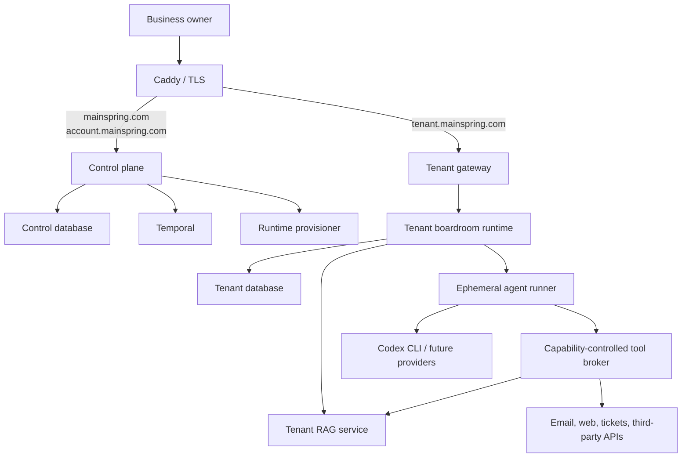

# Mainspring Engine Architecture

Status: Proposed for MVP  
Last updated: 2026-08-06

## Purpose

Mainspring Engine is a multi-tenant platform that gives a small business a persistent AI back office. A customer purchases a boardroom, signs in through a tenant-specific subdomain, and configures specialized personas that can deliberate, retrieve business knowledge, use approved tools, and run on schedules.

The application, rather than an agent, owns boardroom orchestration. Models are replaceable execution providers that perform bounded turns inside an application-controlled workflow.

## Architectural principles

1. **The application owns orchestration.** Agents do not select or invoke other agents directly.
2. **Providers are replaceable.** Codex CLI is the MVP provider; Claude Code, OpenRouter, and other providers can be added without changing the domain model.
3. **Tenant identity is explicit.** Hostname, session, runtime, database credentials, tool grants, logs, and workflow identifiers must agree on the tenant.
4. **Control-plane data and tenant business data remain separate.** Billing and provisioning do not require access to customer documents, conversations, invoices, or integrations.
5. **Tools are capabilities, not prompt suggestions.** The Go harness enforces every tool grant and approval boundary.
6. **Work is durable.** Temporal records boardroom progress, schedules, retries, timers, and human approval waits.
7. **External effects are idempotent or reconciled.** A retry must not silently duplicate an email, invoice, payment, or integration mutation.
8. **Deployment is replaceable.** Docker Compose is the MVP runtime; Kubernetes can replace it through a runtime-provisioner interface.
9. **The MVP is simple, not disposable.** Advanced hardening may wait, but tenant isolation, secret handling, auditability, and recovery boundaries must be correct initially.

## System context



## Control plane

The control plane serves the public site and account area. It owns:

- Customer accounts used for purchasing and subscription management
- Plans, subscriptions, and billing references
- Tenant registry and subdomain reservation
- Runtime-host registry and tenant placement
- Provisioning, upgrade, suspension, and deletion requests
- Platform-level audit and operational status

The control plane does not receive tenant database credentials and does not directly query tenant business records.

## Tenant plane

Each purchased boardroom receives a tenant runtime reached through a unique subdomain. The tenant plane owns:

- Its own login and sessions
- Boardrooms, personas, prompts, and tool grants
- Conversations, messages, runs, and approvals
- Documents, chunks, embeddings, and citations
- Schedules and boardroom configuration
- Integration references and tenant audit events
- Invoices, tickets, and other customer business records

The MVP provisions a boardroom container and a RAG container for each tenant. Both use tenant-specific database credentials. Agent invocations run in short-lived runner containers and do not receive database or Docker credentials.

## Persistence layout

The MVP uses one PostgreSQL server with separate physical databases and roles:

```text
mainspring_control
temporal
temporal_visibility
tenant_<immutable_uuid>
```

Each tenant database has a unique owner/role and enables pgvector. Customer-facing slugs are not used as database, role, container, or volume identifiers.

Temporal stores workflow history and coordination state. PostgreSQL tenant databases remain the source of truth for user-visible domain data. Large prompts, transcripts, files, and model outputs are referenced from Temporal rather than placed directly in workflow histories.

## Primary flows

### Purchase and provisioning

```text
Billing provider confirms purchase
  -> control plane records an idempotent billing event
  -> Temporal starts a tenant-provisioning workflow
  -> provisioner reserves an immutable tenant ID and subdomain
  -> provisioner creates tenant database and roles
  -> provisioner creates secrets, network, and storage
  -> migrations and seed data run
  -> RAG and boardroom containers start
  -> health checks pass
  -> tenant gateway route is registered
  -> one-time owner invitation is created
  -> tenant is marked ready
```

### Boardroom run

```text
User or schedule requests a run
  -> application creates a BoardroomRun
  -> Temporal starts the versioned boardroom workflow
  -> application selects the next persona
  -> provider adapter performs one bounded agent invocation
  -> tool calls pass through the tool broker
  -> results and audit events are persisted
  -> application advances, waits for approval, or completes
```

### Tenant request

```text
Browser requests tenant subdomain
  -> Caddy terminates TLS
  -> tenant gateway resolves the hostname from the tenant registry
  -> request is proxied only to the registered tenant runtime
  -> boardroom runtime validates its host-only tenant session
  -> hostname, session tenant, and runtime tenant must agree
```

## MVP deployment

The initial Hostinger VPS runs Docker and contains:

- Caddy
- Control-plane Go service
- Tenant-gateway Go service
- Local provisioner Go service
- Temporal server and private Temporal UI
- Shared PostgreSQL server
- Per-tenant boardroom and RAG containers
- Ephemeral agent-runner containers
- Backup and monitoring processes

Only Caddy exposes public ports. PostgreSQL, Temporal, the provisioner, and tenant services remain on internal networks.

## Kubernetes migration

Kubernetes is a future runtime backend, not an MVP dependency. Business logic calls a `RuntimeProvisioner` interface rather than Docker directly. The expected mapping is:

| MVP | Future Kubernetes |
| --- | --- |
| Compose project | Namespace or tenant workload group |
| Boardroom/RAG container | Deployment |
| Ephemeral runner | Job |
| Docker network | NetworkPolicy-governed namespace network |
| Docker secret | Kubernetes Secret or external secret |
| Named volume | PersistentVolumeClaim or external storage |

## Minimum security baseline

- No internet-facing process receives the Docker socket.
- Tenant database roles cannot connect to other tenant databases.
- Tenant cookies are `Secure`, `HttpOnly`, `SameSite`, and host-only.
- Agent runners receive short-lived capability tokens but no tenant database, OAuth, or Docker credentials.
- Containers run without privilege, as non-root where supported, with CPU, memory, process, and time limits.
- Tool authorization is checked server-side for every call.
- Secrets and sensitive model content are excluded from logs.
- Public endpoints use TLS and state-changing browser requests use CSRF protection.
- Every external mutation has an action record and stable idempotency key.

## Suggested repository shape

```text
cmd/
  mainspring/
internal/
  control/
  gateway/
  tenancy/
  provisioning/
  boardroom/
  orchestration/
  providers/
  tools/
  rag/
  integrations/
  persistence/
  web/
web/
  components/
  assets/
migrations/
  control/
  tenant/
deploy/
  docker/
  kubernetes/
docs/
  architecture/
```

## Architecture decision records

- [ADR-0001: Use Go and an HTML-over-the-wire frontend](adr/0001-go-html-over-the-wire.md)
- [ADR-0002: Separate the control plane from tenant runtimes](adr/0002-control-plane-and-tenant-runtime.md)
- [ADR-0003: Use a database and role per tenant](adr/0003-tenant-database-isolation.md)
- [ADR-0004: Use Temporal for durable orchestration](adr/0004-temporal-orchestration.md)
- [ADR-0005: Use a provider-neutral agent harness](adr/0005-provider-neutral-agent-harness.md)
- [ADR-0006: Enforce tools through capability grants](adr/0006-capability-controlled-tools.md)
- [ADR-0007: Abstract runtime provisioning](adr/0007-runtime-provisioning.md)
- [ADR-0008: Record and reconcile external side effects](adr/0008-external-side-effects.md)
- [ADR-0009: Adopt a minimum viable security boundary](adr/0009-mvp-security-boundary.md)

## Open questions

- Final production domain and subdomain format
- Tenant authentication method for the first release
- Billing provider and subscription lifecycle rules
- Offsite backup destination, recovery targets, and restore cadence
- Document types supported by the first RAG ingestion pipeline
- Exact web-search and email providers available to the MVP
- Model credential ownership, quotas, and customer usage limits
- Criteria for moving a tenant to dedicated database infrastructure
- Kubernetes distribution and cluster topology after MVP validation

