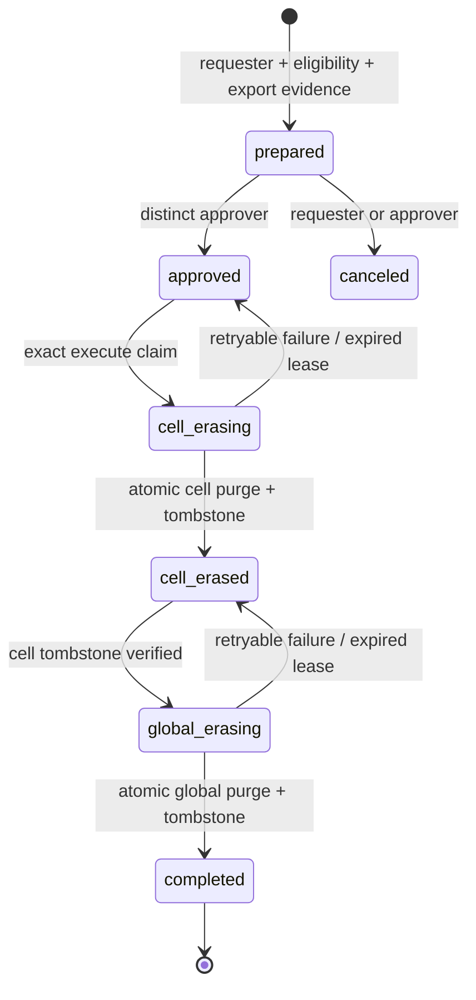

# Account Export and Erasure Workflow

Status: production contract; logical closure and non-destructive four-eyes preparation are executable, while physical erasure remains disabled

Account closure and Account erasure are deliberately different operations. Closure is customer-facing, recoverable during cooling-off, and eventually disables normal access. Erasure destroys live customer data after retention and therefore requires reviewed operator authority, export evidence, cross-store reconciliation, and a durable content-free tombstone.

No HTTP request, account-api replica, or lifecycle-worker attempt may directly erase an Account.

## Safety invariants

1. The Account is already `closed`; `closing`, suspended, restricted, and active Accounts are ineligible.
2. `account_closure_requests.delete_after` has passed according to PostgreSQL time.
3. No active subscription, non-expired Checkout, active usage reservation, moving placement, or unfinished capacity-release job remains.
4. An export artifact exists, has a SHA-256 digest, and has a separately governed expiry. An operator may explicitly record a policy-approved `not_applicable` export only with a reason; an empty reference is never interpreted as approval.
5. The requester and approver are distinct externally authenticated operator identities. Both record environment and reason. Neither string is authentication by itself.
6. The target environment and Account UUID are repeated exactly at each destructive invocation.
7. The target cell ID and placement generation are snapshotted at preparation. A later placement change invalidates approval.
8. Cell erasure commits before global erasure. A content-free cell tombstone makes a crash between those steps idempotently recoverable.
9. Global erasure verifies the cell tombstone, deletes Account-scoped live records in one transaction, decrements cell capacity, and converts the request to a content-free global tombstone.
10. User identity, passkeys, sessions, security events, and Memberships in other Accounts are not erased. Identity deletion is a separate User-scoped workflow.
11. The final tombstones retain no raw Account UUID, name, slug, email, Stripe identifier, Work identifier, free-text reason, or export location. They retain a keyed Account fingerprint, request ID, policy version, environment, stage timestamps, row-class counts, export digest, and backup-expiry deadline.
12. Backups are not rewritten in place. The tombstone tracks the latest backup-expiry deadline; restore procedures must replay completed erasures before a restored environment can serve traffic.

## Authority and process boundaries

The workflow uses short-lived, human-authorized jobs rather than a standing high-privilege worker. The binary currently exposes only the first three actions plus pre-execution cancellation; `execute` and `verify` remain intentionally unavailable:

```text
spyglass account-erasure-admin prepare
spyglass account-erasure-admin inspect
spyglass account-erasure-admin approve
spyglass account-erasure-admin execute
spyglass account-erasure-admin verify
```

`prepare`, `inspect`, `approve`, and global finalization use a narrow global credential. Cell execution uses a credential for exactly the snapshotted cell. `execute` may receive both credentials, but they remain distinct pools and database roles. The command receives no browser session, serving credential, Stripe secret, SMTP secret, route-signing key, or arbitrary SQL surface.

Every action requires:

- `SPYGLASS_OPERATOR_ID`
- `SPYGLASS_OPERATOR_REASON`
- `SPYGLASS_ENVIRONMENT`
- matching `SPYGLASS_CONFIRM_ENVIRONMENT`

Destructive actions additionally require:

- `SPYGLASS_ACCOUNT_ID`
- matching `SPYGLASS_CONFIRM_ACCOUNT_ID`
- `SPYGLASS_ACCOUNT_ERASURE_REQUEST_ID`
- the expected workflow version

Production access control authenticates the human, authorizes the action, injects the short-lived database credential, and records the change/incident reference outside Spyglass. Environment variables only carry the resulting evidence into the command.

## Durable state machine



Cancellation is allowed only before `cell_erasing`. After any cell data is destroyed, the workflow is forward-only. A failure never restores deleted data and never reports completion while a store is unverified.

The global request carries an optimistic version. Execution claims carry a random lease ID and expiry. An expired claim is reclaimable only from its immediately preceding durable state. Every state transition and operator action is immutable.

## Preparation evidence

Preparation snapshots and verifies:

| Evidence | Rule |
|---|---|
| Closure | Latest current closure is `closed`; `delete_after <= statement_timestamp()` |
| Account | State is `closed`; Account version matches the closure result |
| Placement | Directory is disabled/frozen, not moving; Account and directory cell/generation agree |
| Billing | No locally projected subscription except `canceled` or `incomplete_expired`; no active Checkout |
| Usage | No active reservation and all counters are zero |
| Work release | No pending, processing, failed, or dead-letter release job for the Account in the target cell |
| Export | URI/reference is opaque, bounded, and never logged; SHA-256 is exactly 32 bytes |
| Backup | Deadline is at or after the environment's maximum backup retention |
| Policy | Immutable policy version identifies the exact row classes and external systems covered |

Eligibility is rechecked at approval and immediately before each destructive stage. Preparation is not a future permission to ignore changed state.

## Cell erasure transaction

The cell security-definer function accepts only request ID, Account UUID, expected placement generation, keyed Account fingerprint, policy version, operator evidence, and expected request version. It first checks for an existing tombstone:

- Matching request, fingerprint, generation, and policy returns the stored result as an idempotent success.
- Any mismatch is a conflict and deletes nothing.

It then locks `spyglass.account_namespaces`, verifies the namespace is disabled/frozen at the expected generation, and rejects unfinished release jobs. It deletes in dependency order:

1. `spyglass.route_context_receipts`
2. `spyglass.route_context_receipt_cleanup_queue`
3. `spyglass.work_capacity_release_queue`
4. `spyglass.work_item_events`
5. `spyglass.work_items` from deepest children to roots, or through a deferred-safe set delete
6. `spyglass.work_item_number_counters`
7. `spyglass.account_audit_events`
8. Account-targeted `spyglass.work_capacity_release_operator_events`
9. `spyglass.account_namespaces`

Before commit it inserts `spyglass.account_erasure_tombstones` with aggregate counts only. The function must provide a narrowly scoped bypass for immutable audit triggers; the bypass is usable only inside this security-definer function and never granted to serving or ordinary operator roles.

Future package migrations must register every Account-owned cell table in the erasure policy and its integration fixture. A schema gate fails when a new Account foreign key/RLS table is not covered by the current policy version.

## Global erasure transaction

Global finalization verifies the cell tombstone through the cell read-only attestation function, then locks the erasure request, closure request, Account, and directory snapshot. It rechecks billing, placement, usage, and workflow version.

It deletes or minimizes in dependency order:

1. Account-attributed notification outbox rows
2. entitlement recompute queue rows
3. entitlement usage reservations and counters
4. billing Checkout attempts, subscriptions, and billing profile
5. entitlement snapshots and grants
6. invitation rows
7. Account lifecycle and Membership audit events
8. closure requests
9. Memberships
10. account directory
11. Account

The transaction decrements `cells.assigned_accounts` with an underflow guard and converts the erasure request/operator history into its content-free tombstone representation. Raw operator reason and Account UUID exist only in the restricted active-workflow tables and are removed at completion.

The notification outbox now carries nullable Account attribution outside its encrypted envelope. Verification and recovery remain User-scoped; invitations and ownership-transfer notices are Account-attributed and can be selected for erasure without decrypting unrelated identity messages.

`billing_event_inbox` now records nullable Account attribution without a foreign key, because a provider retry can arrive after the Account row is gone. Stripe ingestion derives it only from a valid Spyglass Account UUID in object metadata, Checkout client reference, or subscription metadata. Unknown and non-Account events remain unattributed. Global finalization still needs the erasure-only audit-trigger bypass and a completed-event policy that deletes attributed provider payloads while safely classifying post-erasure retries against the tombstone.

## External systems

Database completion is not full erasure unless the policy version also reconciles external systems:

- Revoke connectors and delete Account-scoped OAuth credentials.
- Stop schedules, workflows, agent runs, and ephemeral runners.
- Delete object-store versions, search/vector indexes, caches, and analytics exports.
- Delete or detach the Stripe Customer only according to finance/tax retention policy; retain no payment data in Spyglass.
- Expire the customer export according to its disclosed download window.
- Record the maximum backup expiry and ensure restore automation reapplies the tombstone.

Each executor produces a signed or locally verifiable attestation digest. The global request stores stage digests while active; the final tombstone stores only a Merkle/root digest or equivalent policy evidence, not provider object identifiers.

## Failure and recovery

| Failure point | Safe retry behavior |
|---|---|
| Before cell commit | Lease expires; no tombstone means retry the cell transaction |
| After cell commit, before global acknowledgement | Cell tombstone makes cell execution idempotent; global state advances on retry |
| Before global commit | Account still exists closed; retry after re-verification |
| After global commit, before command output | Global tombstone makes completion idempotent |
| Attestation mismatch | Stop; mark `investigation_required`; never select a different cell automatically |
| New billing/usage/work activity | Treat as integrity incident because closed Accounts should reject it; erase nothing |
| Backup deadline unknown | Remain approved but ineligible for execution |

No automatic cross-cell fallback is allowed. A missing namespace is success only when a matching tombstone exists; otherwise it is an investigation state.

## Observability and privacy

Metrics use bounded stage/result labels and no Account identifier. Logs may include request ID, policy version, environment, stage, aggregate row counts, and machine error code. Raw Account UUID and export reference are emitted only by explicit restricted `inspect` output and never by standing health endpoints.

Alerts cover oldest approved age, expired execution lease, attestation mismatch, post-close activity, backup deadline breach, repeated retry, and requests stuck after partial erasure.

## Verification requirements

Disposable global/cell PostgreSQL tests must prove:

- before-retention, active billing, active usage, moving placement, and unfinished Work release all fail without mutation;
- requester cannot approve their own request;
- stale version/environment/Account confirmation fails;
- cell deletion removes every registered Account row while preserving another Account under forced RLS;
- crash after cell commit retries through the matching tombstone;
- a missing namespace without a tombstone fails closed;
- global finalization refuses a missing/mismatched cell attestation;
- global deletion removes every registered Account row, preserves shared User identity and other Accounts, and decrements cell capacity once;
- repeated execution returns the same completed tombstone and never underflows capacity;
- immutable event tables reject ordinary mutation and permit only the erasure function's exact target;
- tombstones contain no raw Account, User, Work, Stripe, email, name, reason, or export-reference value;
- restored-backup startup replays completed tombstones before readiness.

The schema-coverage test inventories Account foreign keys, composite Account keys, RLS tables, object namespaces, and attributed outbox/provider rows. A new Feature Package cannot ship Account-owned storage without updating this contract and its deletion proof.

## Delivery sequence

1. Notification/provider payload attribution and restricted active request/operator-event schemas are executable; add the content-free global and cell tombstone schemas alongside execution.
2. Prepare/inspect/cancel/approve services, repeated cell readiness, four-eyes enforcement, and eligibility tests are executable with no deletion authority.
3. Extend the read-only cell readiness function with the cell security-definer erasure/attestation boundary and exhaustive two-Account isolation tests.
4. Add idempotent cross-database execute orchestration and global finalization.
5. Integrate connector, object, index, analytics, Stripe-retention, export-expiry, and backup-replay attestations as those stores become executable.
6. Add restricted Kubernetes Job templates/runbook, alert rules, restore drill, and production security review before enabling an erasure credential.

Until steps 3–4 pass, Spyglass may truthfully report `closed`, a retention deadline, and a prepared/approved erasure request, but it must not report an Account as physically erased.
