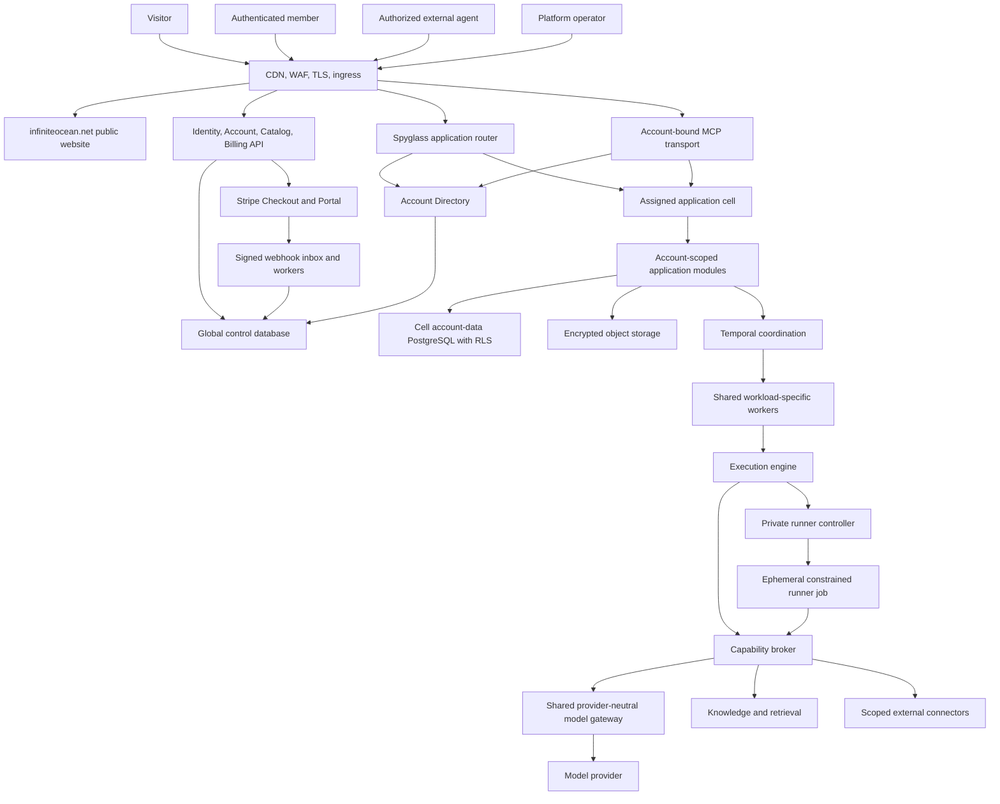
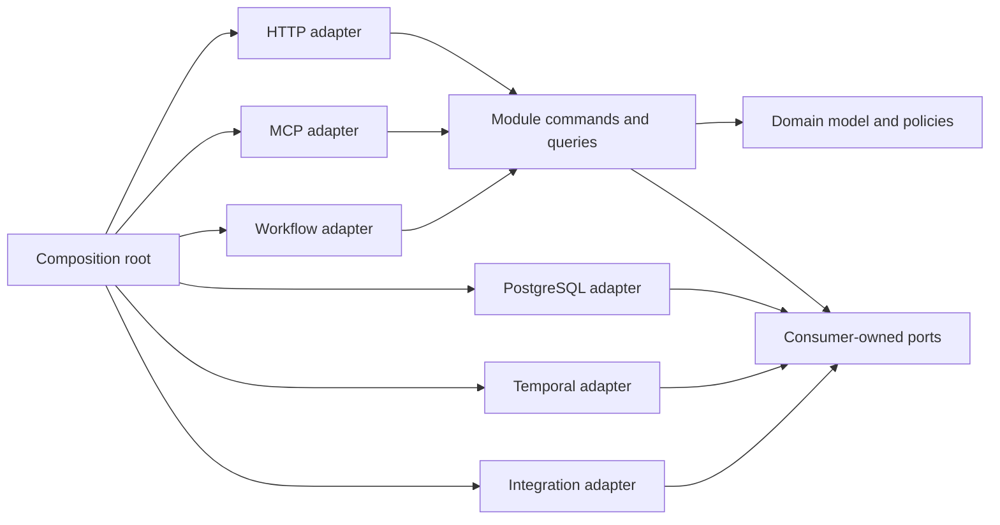

# Target Production Architecture

- Status: Proposed target architecture
- Parent: [Production rewrite plan](README.md)

## 1. System context

Infinite Ocean: Spyglass is an account-isolated business operating system whose AI workers operate inside application-owned workflows.



The global control plane is physically separate from customer business data. Each cell serves many Accounts through shared stateless workloads and a cell database protected by explicit account scope, relational constraints, and row-level security. There is no always-on application stack per ordinary Account.

## 2. Runtime modes

One signed application artifact supports distinct process modes so supply-chain and release management remain simple while privileges stay separated.

| Mode | Responsibility | Privileges |
|---|---|---|
| `website` | Public company/product pages, package discovery, pricing, signup/login entry | Public catalog; no customer business data or payment mutation |
| `account-api` | Identity, Accounts, Memberships, Catalog, Entitlements, Billing, Account Directory, platform operations | Global control database; no account business-record queries |
| `app-router` | Authenticate selected Account, resolve its cell, sign route context | Bounded directory cache; no cell data queries |
| `tool-router` | Authenticate runner brokers with workload mTLS, consume one-use tool context, resolve the cell, sign a least-authority route | Private only; same constrained global router role, no cell data queries |
| `app-api` | Browser/API/MCP use cases for Accounts assigned to one cell | One cell database, object store, account context; no Kubernetes authority |
| `admission-api` | Private package-capacity admission for routed cell commands | Narrow global access projection and usage counters/reservations; no cell/business data |
| `route-receipt-worker` | Bound routed-request replay evidence for one cell | Identifier-only cleanup queue and Account-RLS receipts; no customer Work or global data |
| `route-canary` | Verify candidate route-signing and workload TLS material before cutover | One-shot candidate secrets and dedicated internal canary Account; no database credential or customer data |
| `worker` | Temporal activities and durable business automation for one cell/workload class | One cell database, capability broker, runner-controller client |
| `billing-worker` | Verify/project queued Stripe events and reconcile provider state | Billing subset of global database and Stripe adapter; no business data |
| `work-reconciler` | Release global capacity for terminal cell Work and prune expired completed technical jobs | Narrow cell outbox/Account checkpoint and global usage-release credentials; no serving traffic |
| `agent-dispatch-worker` | Compile immutable Account Agent plans into encrypted runner requests | Identifier-only dispatch functions, forced-RLS read-only plan access, and execute-only exchange provisioning |
| `agent-projection-worker` | Validate and project encrypted terminal Agent results | Execute-only projection functions and runtime envelope keys; no direct Agent or exchange table access |
| `agent-queue-admin` | Audited bounded inspection or exact-target requeue of Agent dispatch/projection dead letters | Execute-only cell operator functions; no queue, prompt, result, exchange, or provider access |
| `work-release-admin` | Audited inspection or exact-target requeue of terminal release failures | Execute-only cell operator functions; no table grants, Work content, or global capacity authority |
| `runner-controller` | Create, cancel, and reconcile ephemeral provider runner jobs | Narrow Kubernetes workload authority; private network; no business database |
| `runner` | Execute one bounded provider invocation and brokered tool loop | Disposable workspace and invocation-bound broker identity; no provider credential or direct provider egress |
| `model-gateway` | Translate one normalized model step to a configured provider | Provider credential and outbound provider HTTPS; no Account database, Kubernetes, browser, or runner credential |
| `migrate` | Apply verified global or cell schema migrations | Migration credential only; never used by serving processes |
| `placement` | Assign or move Accounts between existing cells | Account Directory and migration workflow authority; no Kubernetes creation on signup |

Readiness checks validate required downstreams for the mode. Liveness checks report only whether the process can continue making progress; they do not restart a healthy process merely because a connector is unavailable.

## 3. Module anatomy

Each business module exposes commands and queries through Go types. Its domain and application packages have no framework dependencies.



Interfaces belong to the code that consumes them. Do not introduce an application-wide repository interface or service locator.

## 4. Domain relationships

### 4.1 Identity, account, and commercial access

```text
User
  is a system-wide login identity
PasskeyCredential
  authenticates one User and carries no Account authority
Membership
  grants a User a role in one Spyglass Account
Account
  owns business data, lifecycle, cell placement, billing relationship, and entitlements
FeaturePackage
  identifies a versioned capability group such as Work, Agents, Finance, or Marketing
Plan and Offer
  describe a published commercial selection and map it to provider prices
Subscription
  projects billed provider state for one Account
EntitlementGrant
  grants package access from free plan, subscription, trial, promotion, grandfathering, or support override
EntitlementSnapshot
  is the immutable effective access and limit projection consumed at runtime
```

Authentication establishes a User. Account selection plus an active Membership establishes where that User is acting. Entitlement evaluation establishes which package use cases and limits are available. These checks remain distinct so a User can belong to multiple Accounts and a free Account can exist without billing information.

### 4.2 Workspace and execution

```text
Boardroom
  owns ordered Personas
Persona
  has immutable PersonaVersions
Conversation
  belongs to a Boardroom and retains messages and document attachments
Run
  belongs to a Conversation and snapshots a RunPlan
RunPlan
  contains ordered PlannedPersona versions and effective execution policy
Invocation
  is one idempotent persona turn with attempts, events, usage, tools, and result
Message
  is the user-visible durable contribution created from a successful invocation
```

The run plan is immutable after preparation except for deterministic application-owned delegation expansion. A workflow never looks up mutable persona configuration to reinterpret an already prepared turn. A caller may explicitly attach bounded Work items, accepted Knowledge Facts, and Baseline Assessments. StartRun reads them in one repeatable-read transaction, freezes exact source versions and canonical content on the Run, and records both per-item and aggregate SHA-256 digests. Dispatch uses only that frozen payload plus the Conversation sequence watermark; it never re-joins mutable source tables. Attached content is labeled untrusted evidence and cannot become system instructions. Knowledge sensitivity rules still apply before capture.

### 4.3 Work and attention

```text
WorkItem
  may have a Parent WorkItem
  may be assigned to a User or Persona
  may reference Boardroom, Conversation, Run, Schedule, or BaselineRequirement provenance
HumanInputRequest
  blocks an agent-owned parent and owns question-to-fact links
Approval
  binds an actor decision to a canonical proposed payload hash
ExternalAction
  owns the idempotent execution and reconciliation lifecycle
```

Work state is not inferred from workflow history. Temporal observes and coordinates work; the Work module is authoritative for visible lifecycle.

### 4.4 Baseline and knowledge

```text
BaselineAssessment
  owns interview progress and selected EvidenceRequirements
BusinessFact
  has immutable history and source attribution
EvidenceRequirement
  has disposition, responsibility, status, renewal, and EvidenceLinks
EvidenceLink
  points to a Document revision, SourceItem, or public citation
Document
  has immutable revisions and derived searchable chunks
```

Baseline owns why evidence is required and whether the requirement is satisfied. Knowledge owns the underlying fact, document, revision, source, and citation records.

## 5. Typed lifecycle design

State transitions live in domain policy and are validated before persistence. Repositories reject compare-and-swap conflicts but do not invent transitions.

### 5.1 Work item

```text
open -> in_progress -> waiting -> in_progress -> done
  |          |            |           |
  +----------+------------+-----------+-> canceled
done -> open  (authorized reopen with audit reason)
```

Transition commands include actor, reason, expected version, and time. Completion of a baseline-linked work item emits an explicit requirement-evidence command; no SQL trigger crosses module ownership.

### 5.2 Run

```text
pending -> queued -> preparing -> running
running -> awaiting_attention -> running
running -> completed
pending|queued|preparing|running|awaiting_attention -> failed|canceled
```

Terminal states are immutable. Recovery creates or resumes an idempotent attempt; it does not move a terminal run backward.

### 5.3 Invocation

```text
reserved -> running -> succeeded
reserved|running -> retryable_failure -> running
reserved|running -> failed|canceled
```

One logical invocation may have multiple attempts. The durable message and action projections are unique by logical invocation, not attempt.

### 5.4 Approval and action

```text
Approval: pending -> approved|rejected|expired|canceled
Action: prepared -> executing -> succeeded|failed|unknown
failed -> executing  (explicit retry policy)
unknown -> reconciled_succeeded|reconciled_failed|manual_resolution
```

Approving a record whose payload hash changed is impossible. The user must receive and decide a new proposal.

### 5.5 Baseline

```text
interview -> inventory -> gap_review -> plan_approval -> active -> ready
ready -> reassessment(interview)
any non-archived assessment -> archived when superseded
```

Compatibility database values are mapped at the adapter edge and are not carried into the new domain state type.

## 6. Command, query, and event rules

### Commands

- Express intent: `AnswerBaselineQuestion`, `ApproveAction`, `PostJournalEntry`.
- Carry authenticated actor and expected record version.
- Validate authorization before loading sensitive data where practical.
- Execute in a named transaction boundary.
- Return the updated resource or a stable command receipt.

### Queries

- Return transport-independent read models from owned data.
- Use cursor pagination and bounded filters.
- State consistency expectations explicitly.
- Do not mutate or repair records as a side effect of a request.

### Events

- Represent completed facts: `WorkItemCompleted`, `HumanInputAnswered`, `ActionApproved`.
- Include event ID, schema version, account ID when scoped, aggregate ID, timestamp, causation, correlation, and actor.
- Are written transactionally with the aggregate change using an outbox where asynchronous delivery is required.
- Consumers are idempotent and record their processing checkpoint.
- Sensitive payloads contain references or redacted summaries rather than copied document bodies or credentials.

Use synchronous module calls when the caller requires an immediate invariant. Use events for projections, notifications, and independently recoverable reactions. Do not add an event bus merely to avoid a clear function call.

## 7. Account isolation and authorization

### Identity, Account, and cell resolution

1. Edge validates the host and forwards trusted ingress metadata.
2. Session or bearer authentication yields a system-wide User or workload actor.
3. The requested Account is selected explicitly; middleware verifies active Membership, Account state, and allowed role.
4. The Account Directory resolves immutable `account_id` to `cell_id` and `placement_generation`; a slug is never routing authority.
5. The router signs internal route context and the target cell verifies it.
6. An immutable `AccountContext` is created once and passed explicitly to use cases, workflows, jobs, and repositories.
7. The cell opens a transaction on its shared pool and sets transaction-local account context for RLS.

### Authorization layers

1. Platform authentication and platform role.
2. Account Membership and Account state.
3. Membership role and effective Feature Package entitlement.
4. Object-level relationship, such as conversation membership or assigned responsibility.
5. Agent persona grant and invocation-bound capability conditions.
6. Approval or policy authority for consequential effects.

Authorization decisions return a stable decision code and emit a redacted audit record. Denials must be distinguishable from missing resources internally while preserving non-disclosure in public responses.

## 8. Persistence

### Database ownership

The global control database owns Users, Accounts, Memberships, Catalog, Billing, Entitlements, Account Directory, and platform records. It does not own ordinary customer business records.

A cell database owns business records for many Accounts assigned to that cell. Every customer-owned table has a non-null immutable `account_id`. Account-local uniqueness and cross-table references include `account_id`; runtime roles do not own protected tables or have `BYPASSRLS`. PostgreSQL RLS uses transaction-local account context as a backstop, while repositories also use explicit account predicates. Table ownership is documented by module.

Repositories:

- Accept `context.Context` and a module-level transaction interface.
- Require `AccountContext` for every account-owned operation and reject absent or conflicting scope.
- Use typed IDs and scan into persistence records before mapping to domain objects.
- Implement optimistic concurrency for records with competing writers.
- Return classified errors: not found, conflict, constraint, unavailable, and corruption.
- Never return raw pgx errors above the adapter boundary.
- Keep SQL explicit and reviewable; avoid introducing a generic ORM repository layer.

### Transactions

A use case declares one transaction boundary. The adapter sets RLS account context with `SET LOCAL` at transaction start. Cross-module invariants use a coordinating application service whose transaction supplies module repository adapters over the same cell connection. Global-to-cell operations use durable workflows, outboxes, and idempotent reconciliation rather than distributed transactions.

Agents persists Account-owned Boardrooms, Persona identities, immutable PersonaVersions, Conversations, Runs, ordered RunPlan turns, Invocations, immutable user inputs, execution plans, persona Messages, and customer Run resolutions in separate forced-RLS tables. Every relationship and uniqueness constraint includes `account_id`. Conversation lists use `(updated_at DESC, id DESC)` cursors and Message pages merge immutable human and Persona tables by the shared monotonically allocated sequence without loading an unbounded history. Persona reads repeat strict result-envelope validation and require the visible body to equal the structured contribution. A routed Run command admits current `agents` access and the Account-local concurrent-run limit once, then freezes entitlement/Boardroom versions, exact Persona versions, the conversation watermark, runner profile, request expiry, and deterministic model/tool operation UUIDs in the same transaction as its user message and invocations. Explicit Work items, accepted Facts, Baseline assessments and ready current Knowledge Document revisions are captured in that transaction as one digest-bound bounded context envelope. A document attachment contains every ordered integrity-checked chunk or the Run is rejected; restricted sensitivity is rechecked and no truncation or later source read is permitted. Only the first ordered turn is initially dispatchable. Each successful projection commits its validated Persona Message, advances exactly the next turn's execution-plan watermark to that sequence and enqueues that next invocation in the same transaction. Consequently each Persona observes all prior contributions while source snapshots and Persona versions remain frozen. Failure projection cancels all still-queued downstream turns and makes the Run terminal, preventing a partially executed plan from retaining unreachable work. A terminal failure is never rewritten: one immutable resolution either accepts it with an actor and note or creates a separately governed retry Run containing only failed turns. Retry reauthorizes current package capacity, freezes the current entitlement version, and reuses the original context watermark and exact PersonaVersion digests rather than silently acquiring later configuration.

The private Agents browser workspace is a replaceable edge client of those routed contracts. The global shell gives it only the selected Account ID and effective package mode; Boardrooms, Personas, Conversations, Messages, Runs, and customer recovery decisions are reached through the app router. It has no placement selection, cell origin, route-signing material, provider credential, or direct persistence dependency. Read-only access omits both Run and recovery forms entirely.

A content-free dispatch queue coordinates shared cell workers across Accounts. Each worker holds an expiring lease, enters the claimed Account's RLS scope, builds only from that immutable snapshot, provisions an encrypted runner exchange, and may settle only the exact canonical request digest found in the exchange. For an ordered plan, the queue contains only the current turn; later turns become visible one at a time after the preceding projection has committed. A separate content-free projection queue coordinates terminal results. Its worker must hold its exact expiring lease, authenticate and decrypt the Pod-bound envelope, and repeat domain validation before the accepted result digest can be projected. Invocation success, the next conversation sequence, exactly one persona Message, next-turn watermark/enqueue, Run state, and projection settlement then commit atomically. Failure projection records no Message and atomically cancels undispatched downstream turns. Cross-Account queue roles receive only narrow execution functions; the dispatcher additionally receives read-only access to the forced-RLS planning tables. Dead letters preserve ciphertext, and retention skips every unprojected Agent result. Account erasure counts and removes all customer and identifier-only Agents records before deleting the namespace.

### Documents and object storage

The database stores metadata, extracted bounded text, chunk identity, revision provenance, and object references. Original binaries live in encrypted object storage with:

- Account-prefixed immutable keys whose requested account is verified before signed access is issued.
- Content hash and size validation.
- Quarantine and malware-scan status.
- Server-side encryption and restricted service identity.
- Retention, legal hold, and deletion state.
- No public bucket URLs.

Extraction occurs in a constrained worker with media-type verification, decompression limits, timeouts, and no external network.

## 9. Knowledge retrieval

Retrieval is an authorized application capability, not a provider feature.

1. Resolve effective document and fact scope from persona grants and run attachments.
2. Normalize and bound the query.
3. Search metadata/text and optional embeddings through a replaceable index port.
4. Return stable citation IDs tied to exact document revision and chunk.
5. Limit result count, per-result size, aggregate bytes, and sensitivity.
6. Record the query, scope, result citation IDs, latency, and invoking identity.
7. Treat all retrieved content as untrusted evidence and isolate it from system instructions.

Reindexing creates a new index generation and switches atomically after completeness checks. Existing citations continue resolving to the original revision even if the current document changes.

## 10. Capability broker

The broker is intentionally small.

It owns:

- Tool-definition registration.
- Grant-to-definition visibility.
- Signed claim verification.
- Account, actor, persona, invocation, expiry, and condition enforcement.
- Input schema validation and bounds.
- Handler invocation and bounded output.
- Allow/deny/error audit.

It does not own:

- Approval workflow.
- Work creation policy.
- Business knowledge coordination.
- Finance domain rules.
- Connector credentials.
- Provider prompting.

A tool adapter calls a module use case using the actor encoded in verified claims. The module repeats object-level authorization; broker approval alone is not sufficient to violate a domain invariant.

## 11. Workflow architecture

Temporal workflows contain deterministic coordination only.

- Workflow and signal payloads are versioned.
- Activities are idempotent by stable application IDs.
- Large data remains in PostgreSQL/object storage and is referenced by ID.
- Retry policy is based on classified errors, not generic failure.
- Non-retryable validation and authorization errors fail immediately.
- Provider rate limits and temporary unavailability use bounded backoff and circuit information.
- Human waits use typed signals correlated to durable attention records.
- Workflow code changes use version markers and retain replay fixtures for every released path.
- A workflow repair command reconciles database and workflow state without ad hoc SQL.

Schedules create dated conversations and runs through the same Workspace and Execution commands used by user requests.

## 12. Provider and runner boundary

The provider-neutral contract includes:

- Invocation identity and deadline.
- Persona identity and system policy.
- Bounded conversation and authorized tool results.
- Strict output schema.
- Provider/model/reasoning parameters.
- Input, output, tool-result, and cost ceilings.
- Cancellation.
- Structured usage and classified failure.

The runner owns the bounded turn/tool loop but reaches both model steps and business tools only through separately named broker capabilities. The broker injects invocation and operation identity into model requests, so runner payload cannot select another invocation. `parallel_tool_calls=false` makes each provider step yield at most one auditable tool request. Tool arguments and the final result use independent strict JSON schemas. Provider continuation items are opaque to Spyglass orchestration and are returned only to the same provider adapter on the next step.

The shared model gateway is stateless and horizontally scalable. Its adapter sends `store=false`, holds the provider key, classifies provider failures, enforces bounded request/response bodies, and returns normalized output, tool call, continuation, and usage fields. An operator-owned exact-model price book is the sole pricing authority: unpriced models fail before provider invocation, and the gateway computes micro-unit cost from validated usage. The bounded runner accumulates that trusted cost across sequential steps and stops at the immutable Persona ceiling; the final value is projected with the token counters for Account-visible audit. The gateway has no Account database or customer authorization authority; Account, package, cancellation, and capability policy remain broker concerns.

The runner receives no database credential, Docker socket, account integration secret, provider credential, Kubernetes API authority, or long-lived capability. It runs as non-root with a read-only root filesystem, dropped capabilities, bounded tmpfs, CPU/memory/PID/time limits, broker-only egress, and a disposable work directory.

The runner controller is private privileged infrastructure. Every container has an invocation label and lease so startup and periodic reconciliation can remove orphans safely.

## 13. HTTP and streaming

Route organization mirrors features, not page technology:

```text
/api/v1/identity/*
/api/v1/users/me
/api/v1/accounts
GET    /api/v1/accounts/{account_id}/memberships
PATCH  /api/v1/accounts/{account_id}/memberships/{membership_id}
DELETE /api/v1/accounts/{account_id}/memberships/{membership_id}
POST   /api/v1/accounts/{account_id}/memberships/{membership_id}/suspensions
DELETE /api/v1/accounts/{account_id}/memberships/{membership_id}/suspensions
DELETE /api/v1/accounts/{account_id}/membership
POST   /api/v1/accounts/{account_id}/ownership-transfers
/api/v1/accounts/{account_id}/entitlements
/api/v1/catalog/public
/api/v1/accounts/{account_id}/checkout-sessions
/api/v1/accounts/{account_id}/billing-portal-sessions
/api/v1/accounts/{account_id}/billing
/webhooks/stripe
/api/v1/accounts/{account_id}/work-items
/api/v1/attention
/api/v1/baselines
/api/v1/knowledge/documents
/api/v1/boardrooms
/api/v1/conversations
/api/v1/runs
/api/v1/agents
/api/v1/schedules
/api/v1/finance
/api/v1/integrations
```

The API version is independent from the prototype's internal `/api/v2` label. Compatibility adapters may expose old paths temporarily.

Public catalog endpoints expose only published presentation data and opaque local Offer IDs. Stripe webhook ingestion is a separate raw-body, signature-verified surface. Account-scoped routes verify that URL Account, Membership, route context, cell assignment, resource Account, and entitlement agree. Package denial uses stable machine-readable errors and applies equally through HTTP, MCP, schedules, workers, and agent tools.

SSE streams publish lightweight invalidation or resource events:

```json
{
  "version": 1,
  "id": "event-id",
  "cursor": "opaque-monotonic-cursor",
  "type": "run.message.created",
  "resource": {"kind": "conversation", "id": "...", "version": 12},
  "occurred_at": "RFC3339 timestamp"
}
```

Clients refetch authoritative resources after an invalidation. Streams are not the sole persistence or a hidden command channel.

## 14. Frontend architecture

```text
website/
  public company and product routes
  package and pricing pages
  signup, login, legal, support
ui/src/
  app/
    router/
    providers/
    shell/
  features/
    account/
    packages/
    billing/
    work/
      api/
      components/
      routes/
      state/
      tests/
    attention/
    baseline/
    knowledge/
    workspace/
    agents/
    finance/
    integrations/
  shared/
    api/
    auth/
    components/
    formatting/
    streaming/
    testing/
```

Rules:

- Features import shared primitives, never another feature's private components.
- Account selection is explicit; changing Account cancels in-flight account queries and replaces account-keyed caches.
- Package-aware navigation improves discovery but is never treated as authorization.
- Server state stays in TanStack Query; local UI state stays local or in a narrowly scoped store.
- Query keys are generated from resource identity and filters.
- Mutations invalidate or update exact resources; broad cache clearing is avoided.
- Optimistic updates are limited to reversible operations with complete rollback data.
- Forms retain drafts across recoverable failures and expose field-level server errors.
- A central session boundary handles expiry and reauthentication without losing drafts.
- Route-level chunks and dependency budgets prevent one monolithic bundle.
- Accessibility tests cover semantics, names, focus, keyboard flows, contrast, motion, and live updates.

## 15. Configuration and secrets

Configuration is typed, documented, and validated at process start.

- Environment variables contain non-secret deployment configuration and secret references.
- Production secrets come from a managed secret store or workload identity.
- Each runtime mode receives only the secrets it requires.
- Secret values are redacted from logs, errors, traces, panic reports, and support exports.
- Encryption keys are versioned so credentials can be rewrapped during rotation.
- Provider auth is isolated from account integration credentials.
- Configuration exposes safe effective values on an operator endpoint without secret material.

## 16. Observability

All telemetry carries request/correlation ID, service mode, release, environment, cell, and safe account hash. Raw document content, prompts, message bodies, credentials, email content, and owner answers are excluded by default.

Required signals include:

- HTTP rate, latency, errors, saturation, and status codes.
- Database pool usage, query groups, transaction retries, migration version, and slow-query sampling.
- Workflow starts, task latency, activity attempts, retries, signals, stuck runs, and replay failures.
- Runner queue time, startup time, duration, cancellation, orphan cleanup, and resource exhaustion.
- Provider calls, failure categories, token usage, cached tokens, estimated/actual cost, and circuit state.
- Tool allow/deny/error, latency, result bytes, and capability name.
- Approval age, human-input age, unknown actions, outbox age, and reconciliation outcome.
- Document ingestion, extraction failure, indexing lag, retrieval latency, and citation validation failure.
- Signup completion, cell placement, entitlement projection age, billing webhook backlog, reconciliation mismatch, and package denials.
- Per-cell saturation, account fairness, queue age, pod scaling latency, PostgreSQL connection headroom, and placement capacity.

Trace propagation stops at provider boundaries that cannot safely accept internal trace context; correlation continues through application IDs.

## 17. Deployment and rollout

Production changes progress through:

1. Build, sign, and generate an SBOM and provenance record.
2. Run unit, contract, integration, replay, frontend, and migration tests.
3. Deploy to an ephemeral environment from the produced artifact.
4. Run end-to-end and security smoke tests.
5. Deploy to staging and execute synthetic flows.
6. Migrate an internal Account cohort and deploy to a canary cell.
7. Compare health, business invariants, costs, and compatibility mismatches.
8. Increase cell and Account cohorts with automated stop conditions.
9. Retain the previous application image and backward-compatible schema during the rollback window.

Database rollback normally means application rollback against additive schema, not reversing a migration that may already contain customer writes.

Kubernetes uses separate shared deployments for the website, account API, app router/API, workflow workers, ingestion/indexing workers, connector workers, billing workers, and runner controller. HPA and event-driven scaling use CPU/request signals plus queue age and Temporal schedule-to-start latency. Resource bounds, fair admission, topology spread, disruption budgets, and downstream connection/provider ceilings prevent scaling from simply moving overload elsewhere. See [kubernetes-topology.md](kubernetes-topology.md).
