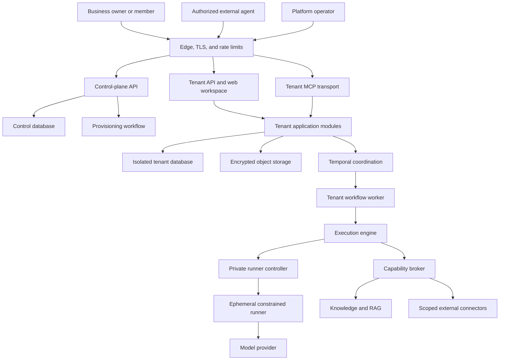
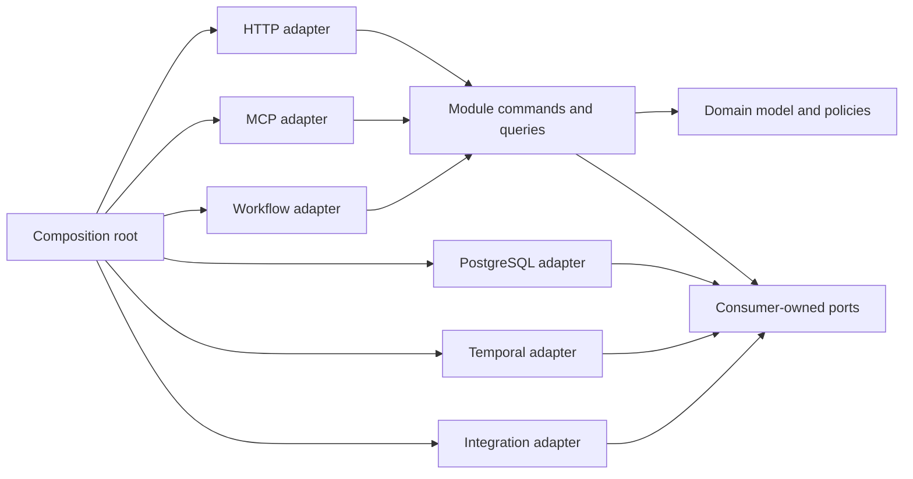

# Target Production Architecture

- Status: Proposed target architecture
- Parent: [Production rewrite plan](README.md)

## 1. System context

Mainspring is a tenant-isolated business operating system whose AI workers operate inside application-owned workflows.



The first production release keeps the control plane physically separate from tenant business data and keeps a physical database and credential boundary per tenant.

## 2. Runtime modes

One signed application artifact supports distinct process modes so supply-chain and release management remain simple while privileges stay separated.

| Mode | Responsibility | Privileges |
|---|---|---|
| `control` | Tenant registry, subscriptions, provisioning requests, platform operations | Control database; Temporal control namespace; no tenant record queries |
| `gateway` | Host validation, tenant route resolution, forwarding identity | Read-only route registry; no tenant databases |
| `tenant-api` | Browser/API/MCP requests for one resolved tenant | Tenant database and tenant-scoped service credentials; no Docker socket |
| `worker` | Temporal activities and durable business automation | Tenant database, capability broker, runner-controller client |
| `runner-controller` | Create, cancel, and reconcile ephemeral provider containers | Container runtime; private network only; no business database |
| `runner` | Execute one bounded provider invocation | Disposable workspace, provider credential, short-lived tool token |
| `migrate` | Apply verified control or tenant schema migrations | Migration credential only; never used by serving processes |
| `provision` | Create tenant infrastructure through a provisioner port | Narrow infrastructure authority and control-plane workflow identity |

Readiness checks validate required downstreams for the mode. Liveness checks report only whether the process can continue making progress; they do not restart a healthy process merely because a connector is unavailable.

## 3. Module anatomy

Each business module exposes commands and queries through Go types. Its domain and application packages have no framework dependencies.



Interfaces belong to the code that consumes them. Do not introduce an application-wide repository interface or service locator.

## 4. Domain relationships

### 4.1 Workspace and execution

```text
Boardroom
  owns ordered Personas
Persona
  has immutable PersonaVersions
Conversation
  belongs to a Boardroom and retains messages and document attachments
Run
  belongs to a Conversation and snapshots a RunPlan
RunPlan
  contains ordered PlannedPersona versions and effective execution policy
Invocation
  is one idempotent persona turn with attempts, events, usage, tools, and result
Message
  is the user-visible durable contribution created from a successful invocation
```

The run plan is immutable after preparation except for deterministic application-owned delegation expansion. A workflow never looks up mutable persona configuration to reinterpret an already prepared turn.

### 4.2 Work and attention

```text
WorkItem
  may have a Parent WorkItem
  may be assigned to a User or Persona
  may reference Boardroom, Conversation, Run, Schedule, or BaselineRequirement provenance
HumanInputRequest
  blocks an agent-owned parent and owns question-to-fact links
Approval
  binds an actor decision to a canonical proposed payload hash
ExternalAction
  owns the idempotent execution and reconciliation lifecycle
```

Work state is not inferred from workflow history. Temporal observes and coordinates work; the Work module is authoritative for visible lifecycle.

### 4.3 Baseline and knowledge

```text
BaselineAssessment
  owns interview progress and selected EvidenceRequirements
BusinessFact
  has immutable history and source attribution
EvidenceRequirement
  has disposition, responsibility, status, renewal, and EvidenceLinks
EvidenceLink
  points to a Document revision, SourceItem, or public citation
Document
  has immutable revisions and derived searchable chunks
```

Baseline owns why evidence is required and whether the requirement is satisfied. Knowledge owns the underlying fact, document, revision, source, and citation records.

## 5. Typed lifecycle design

State transitions live in domain policy and are validated before persistence. Repositories reject compare-and-swap conflicts but do not invent transitions.

### 5.1 Work item

```text
open -> in_progress -> waiting -> in_progress -> done
  |          |            |           |
  +----------+------------+-----------+-> canceled
done -> open  (authorized reopen with audit reason)
```

Transition commands include actor, reason, expected version, and time. Completion of a baseline-linked work item emits an explicit requirement-evidence command; no SQL trigger crosses module ownership.

### 5.2 Run

```text
pending -> queued -> preparing -> running
running -> awaiting_attention -> running
running -> completed
pending|queued|preparing|running|awaiting_attention -> failed|canceled
```

Terminal states are immutable. Recovery creates or resumes an idempotent attempt; it does not move a terminal run backward.

### 5.3 Invocation

```text
reserved -> running -> succeeded
reserved|running -> retryable_failure -> running
reserved|running -> failed|canceled
```

One logical invocation may have multiple attempts. The durable message and action projections are unique by logical invocation, not attempt.

### 5.4 Approval and action

```text
Approval: pending -> approved|rejected|expired|canceled
Action: prepared -> executing -> succeeded|failed|unknown
failed -> executing  (explicit retry policy)
unknown -> reconciled_succeeded|reconciled_failed|manual_resolution
```

Approving a record whose payload hash changed is impossible. The user must receive and decide a new proposal.

### 5.5 Baseline

```text
interview -> inventory -> gap_review -> plan_approval -> active -> ready
ready -> reassessment(interview)
any non-archived assessment -> archived when superseded
```

Compatibility database values are mapped at the adapter edge and are not carried into the new domain state type.

## 6. Command, query, and event rules

### Commands

- Express intent: `AnswerBaselineQuestion`, `ApproveAction`, `PostJournalEntry`.
- Carry authenticated actor and expected record version.
- Validate authorization before loading sensitive data where practical.
- Execute in a named transaction boundary.
- Return the updated resource or a stable command receipt.

### Queries

- Return transport-independent read models from owned data.
- Use cursor pagination and bounded filters.
- State consistency expectations explicitly.
- Do not mutate or repair records as a side effect of a request.

### Events

- Represent completed facts: `WorkItemCompleted`, `HumanInputAnswered`, `ActionApproved`.
- Include event ID, schema version, tenant ID, aggregate ID, timestamp, causation, correlation, and actor.
- Are written transactionally with the aggregate change using an outbox where asynchronous delivery is required.
- Consumers are idempotent and record their processing checkpoint.
- Sensitive payloads contain references or redacted summaries rather than copied document bodies or credentials.

Use synchronous module calls when the caller requires an immediate invariant. Use events for projections, notifications, and independently recoverable reactions. Do not add an event bus merely to avoid a clear function call.

## 7. Tenancy and authorization

### Tenant resolution

1. Edge validates the host and forwards a signed route identity or resolves through a trusted internal gateway.
2. Session or bearer authentication yields an actor.
3. Tenant middleware verifies route tenant, session tenant, requested resource tenant, and runtime assignment.
4. A `TenantContext` is created once and passed explicitly.
5. Database resolution selects the tenant credential using the immutable tenant ID, never a user-facing slug.

### Authorization layers

1. Platform authentication and platform role.
2. Tenant membership and state.
3. Tenant role and feature entitlement.
4. Object-level relationship, such as conversation membership or assigned responsibility.
5. Agent persona grant and invocation-bound capability conditions.
6. Approval or policy authority for consequential effects.

Authorization decisions return a stable decision code and emit a redacted audit record. Denials must be distinguishable from missing resources internally while preserving non-disclosure in public responses.

## 8. Persistence

### Database ownership

The control database owns only platform records. A tenant database owns all business records for exactly one immutable tenant ID. Within a tenant database, table ownership is documented by module even if existing table names remain unchanged during migration.

Repositories:

- Accept `context.Context` and a module-level transaction interface.
- Use typed IDs and scan into persistence records before mapping to domain objects.
- Implement optimistic concurrency for records with competing writers.
- Return classified errors: not found, conflict, constraint, unavailable, and corruption.
- Never return raw pgx errors above the adapter boundary.
- Keep SQL explicit and reviewable; avoid introducing a generic ORM repository layer.

### Transactions

A use case declares one transaction boundary. Cross-module invariants use a coordinating application service whose transaction supplies module repository adapters over the same tenant connection. If a future deployment splits a module, the coordinating contract must be redesigned rather than pretending a distributed transaction exists.

### Documents and object storage

The database stores metadata, extracted bounded text, chunk identity, revision provenance, and object references. Original binaries live in encrypted object storage with:

- Tenant-prefixed immutable keys.
- Content hash and size validation.
- Quarantine and malware-scan status.
- Server-side encryption and restricted service identity.
- Retention, legal hold, and deletion state.
- No public bucket URLs.

Extraction occurs in a constrained worker with media-type verification, decompression limits, timeouts, and no external network.

## 9. Knowledge retrieval

Retrieval is an authorized application capability, not a provider feature.

1. Resolve effective document and fact scope from persona grants and run attachments.
2. Normalize and bound the query.
3. Search metadata/text and optional embeddings through a replaceable index port.
4. Return stable citation IDs tied to exact document revision and chunk.
5. Limit result count, per-result size, aggregate bytes, and sensitivity.
6. Record the query, scope, result citation IDs, latency, and invoking identity.
7. Treat all retrieved content as untrusted evidence and isolate it from system instructions.

Reindexing creates a new index generation and switches atomically after completeness checks. Existing citations continue resolving to the original revision even if the current document changes.

## 10. Capability broker

The broker is intentionally small.

It owns:

- Tool-definition registration.
- Grant-to-definition visibility.
- Signed claim verification.
- Tenant, actor, persona, invocation, expiry, and condition enforcement.
- Input schema validation and bounds.
- Handler invocation and bounded output.
- Allow/deny/error audit.

It does not own:

- Approval workflow.
- Work creation policy.
- Business knowledge coordination.
- Finance domain rules.
- Connector credentials.
- Provider prompting.

A tool adapter calls a module use case using the actor encoded in verified claims. The module repeats object-level authorization; broker approval alone is not sufficient to violate a domain invariant.

## 11. Workflow architecture

Temporal workflows contain deterministic coordination only.

- Workflow and signal payloads are versioned.
- Activities are idempotent by stable application IDs.
- Large data remains in PostgreSQL/object storage and is referenced by ID.
- Retry policy is based on classified errors, not generic failure.
- Non-retryable validation and authorization errors fail immediately.
- Provider rate limits and temporary unavailability use bounded backoff and circuit information.
- Human waits use typed signals correlated to durable attention records.
- Workflow code changes use version markers and retain replay fixtures for every released path.
- A workflow repair command reconciles database and workflow state without ad hoc SQL.

Schedules create dated conversations and runs through the same Workspace and Execution commands used by user requests.

## 12. Provider and runner boundary

The provider contract includes:

- Invocation identity and deadline.
- Persona identity and system policy.
- Bounded conversation and authorized tool results.
- Strict output schema.
- Provider/model/reasoning parameters.
- Input, output, tool-result, and cost ceilings.
- Cancellation.
- Structured usage and classified failure.

The runner receives no database credential, Docker socket, tenant integration secret, or long-lived capability. It runs as non-root with a read-only root filesystem, dropped capabilities, bounded tmpfs, CPU/memory/PID/time limits, an allowlisted egress policy, and a disposable work directory.

The runner controller is private privileged infrastructure. Every container has an invocation label and lease so startup and periodic reconciliation can remove orphans safely.

## 13. HTTP and streaming

Route organization mirrors features, not page technology:

```text
/api/v1/session
/api/v1/work-items
/api/v1/attention
/api/v1/baselines
/api/v1/knowledge/documents
/api/v1/boardrooms
/api/v1/conversations
/api/v1/runs
/api/v1/agents
/api/v1/schedules
/api/v1/finance
/api/v1/integrations
```

The API version is independent from the prototype's internal `/api/v2` label. Compatibility adapters may expose old paths temporarily.

SSE streams publish lightweight invalidation or resource events:

```json
{
  "version": 1,
  "id": "event-id",
  "cursor": "opaque-monotonic-cursor",
  "type": "run.message.created",
  "resource": {"kind": "conversation", "id": "...", "version": 12},
  "occurred_at": "RFC3339 timestamp"
}
```

Clients refetch authoritative resources after an invalidation. Streams are not the sole persistence or a hidden command channel.

## 14. Frontend architecture

```text
ui/src/
  app/
    router/
    providers/
    shell/
  features/
    work/
      api/
      components/
      routes/
      state/
      tests/
    attention/
    baseline/
    knowledge/
    workspace/
    agents/
    finance/
    integrations/
  shared/
    api/
    auth/
    components/
    formatting/
    streaming/
    testing/
```

Rules:

- Features import shared primitives, never another feature's private components.
- Server state stays in TanStack Query; local UI state stays local or in a narrowly scoped store.
- Query keys are generated from resource identity and filters.
- Mutations invalidate or update exact resources; broad cache clearing is avoided.
- Optimistic updates are limited to reversible operations with complete rollback data.
- Forms retain drafts across recoverable failures and expose field-level server errors.
- A central session boundary handles expiry and reauthentication without losing drafts.
- Route-level chunks and dependency budgets prevent one monolithic bundle.
- Accessibility tests cover semantics, names, focus, keyboard flows, contrast, motion, and live updates.

## 15. Configuration and secrets

Configuration is typed, documented, and validated at process start.

- Environment variables contain non-secret deployment configuration and secret references.
- Production secrets come from a managed secret store or workload identity.
- Each runtime mode receives only the secrets it requires.
- Secret values are redacted from logs, errors, traces, panic reports, and support exports.
- Encryption keys are versioned so credentials can be rewrapped during rotation.
- Provider auth is isolated from tenant integration credentials.
- Configuration exposes safe effective values on an operator endpoint without secret material.

## 16. Observability

All telemetry carries request/correlation ID, service mode, release, environment, and safe tenant hash. Raw document content, prompts, message bodies, credentials, email content, and owner answers are excluded by default.

Required signals include:

- HTTP rate, latency, errors, saturation, and status codes.
- Database pool usage, query groups, transaction retries, migration version, and slow-query sampling.
- Workflow starts, task latency, activity attempts, retries, signals, stuck runs, and replay failures.
- Runner queue time, startup time, duration, cancellation, orphan cleanup, and resource exhaustion.
- Provider calls, failure categories, token usage, cached tokens, estimated/actual cost, and circuit state.
- Tool allow/deny/error, latency, result bytes, and capability name.
- Approval age, human-input age, unknown actions, outbox age, and reconciliation outcome.
- Document ingestion, extraction failure, indexing lag, retrieval latency, and citation validation failure.

Trace propagation stops at provider boundaries that cannot safely accept internal trace context; correlation continues through application IDs.

## 17. Deployment and rollout

Production changes progress through:

1. Build, sign, and generate an SBOM and provenance record.
2. Run unit, contract, integration, replay, frontend, and migration tests.
3. Deploy to an ephemeral environment from the produced artifact.
4. Run end-to-end and security smoke tests.
5. Deploy to staging and execute synthetic flows.
6. Migrate a canary tenant cohort.
7. Compare health, business invariants, costs, and compatibility mismatches.
8. Increase cohorts with automated stop conditions.
9. Retain the previous application image and backward-compatible schema during the rollback window.

Database rollback normally means application rollback against additive schema, not reversing a migration that may already contain customer writes.
