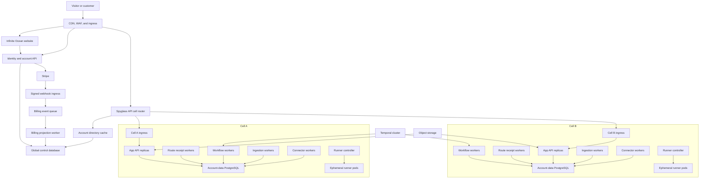

# Pooled Kubernetes and Cell Architecture

- Status: Accepted direction; durable fair runner admission implemented, Kubernetes execution and thresholds require applied evidence
- Product: Infinite Ocean: Spyglass
- Parent: [Production plan](README.md)

## 1. Decision

Spyglass will not provision a long-running container, application stack, or Kubernetes namespace per customer account. The production platform uses shared, stateless deployments grouped by workload class. Requests and durable jobs carry an explicit `account_id`; a trusted account directory routes that account to one data cell.

The unit of horizontal scaling is a workload class inside a cell, not a customer. The unit of data placement and failure containment is the cell. A cell serves many accounts with the same versioned application images and an account-isolated data plane.

This preserves a path to dedicated enterprise placement: an account can later be assigned to a dedicated cell or database without changing domain code, API contracts, or container images.

## 2. Why cells

A single fleet-wide shared database makes early operations simple but creates an ever-growing blast radius. A database per account maximizes physical isolation but creates connection, migration, backup, scheduling, and cost pressure at customer scale. Cells provide a bounded middle layer:

- New accounts are assigned to one cell by the control plane.
- Each cell has a known account and workload capacity envelope.
- Application and worker deployments scale independently within the cell.
- A cell can be drained, upgraded, restored, or isolated without affecting the entire fleet.
- Large or regulated accounts can receive a dedicated cell through the same placement abstraction.
- Capacity is added by creating cells, not redesigning the application.

## 3. System topology



The diagram is logical. Early environments may run several workload classes in one cluster and share managed infrastructure. The identity, placement, scaling, and access boundaries still apply.

## 4. Global control plane

The global control database owns only fleet-wide and commercially global records:

- Users, authentication identities, sessions, recovery factors, and security events.
- Spyglass Accounts, Memberships, invitations, roles, and account lifecycle.
- Published Catalog versions, Offers, Plans, and Feature Package definitions.
- Billing Profiles, provider references, Subscriptions, webhook inbox records, and reconciliation state.
- Entitlement Grants and effective Entitlement Snapshots.
- Account directory entries, cell assignments, placement state, and migration state.
- Platform operations, support access grants, audit index, and cell health summaries.

It does not own ordinary Work, Agent, Finance, Marketing, Knowledge, message, or document records. Control-plane unavailability must not require an immediate synchronous lookup for every already-routed application request. Signed route context and bounded caches allow existing sessions and jobs to continue for a deliberately short window, while account creation, membership changes, billing management, and placement changes pause.

## 5. Cell data plane

Each cell contains:

- An ingress or service-mesh boundary accepting only trusted internal route identity.
- Stateless Spyglass API replicas.
- Shared route-receipt retention workers coordinated by an identifier-only cell queue.
- Stateless Temporal workflow/activity workers partitioned by task queue.
- Specialized ingestion, indexing, and connector workers.
- A runner controller and ephemeral sandboxed runner jobs.
- One account-data PostgreSQL cluster, with replicas and recovery policy appropriate to the environment.
- Cell-scoped caches and queue consumers where needed.

Every customer-owned relational table has a non-null immutable `account_id`. Account scope is part of primary or unique keys when uniqueness is account-local. Cross-table relationships use composite foreign keys including `account_id` so a record cannot reference another account accidentally.

### Defense-in-depth database isolation

1. The trusted router resolves `account_id` to `cell_id` from the Account Directory.
2. The cell verifies the signed internal route identity and authenticated actor context.
3. The application begins a transaction and executes `SET LOCAL app.account_id = ...` using a typed value, never interpolated SQL.
4. PostgreSQL row-level security policies restrict account-owned tables to the current account.
5. Repositories include explicit `account_id` predicates even with RLS enabled.
6. Runtime database roles cannot own protected tables and cannot use `BYPASSRLS`.
7. Background jobs, workflow payloads, cache keys, object keys, search documents, and audit events carry the same account identity.
8. Cross-account tests attempt reads, writes, joins, foreign-key references, cache access, jobs, exports, and object retrieval.

RLS is a backstop, not a substitute for application authorization. Membership, role, entitlement, capability, and object policy are evaluated before repository calls.

## 6. Account routing

`AccountDirectoryEntry` contains:

```text
account_id
cell_id
placement_generation
state: active | draining | frozen | moving | disabled
data_region
updated_at
```

The browser selects an account after authentication. The server verifies Membership and issues or refreshes a short-lived account context containing the immutable account ID and placement generation. Slugs are presentation aliases and are never routing authority.

The edge/API router:

1. Authenticates the session or workload token.
2. Validates the selected Account and Membership.
3. Reads the account directory from a bounded cache backed by the global database.
4. Routes to the assigned cell and signs the internal route context.
5. Rejects stale generations during cell moves and refreshes placement.

No pod holds an account-specific connection pool. Each cell deployment pools connections to its cell database and sets transaction-local account context for each operation.

## 7. Workload classes

| Workload | Lifetime | Scaling signal | Account controls |
|---|---|---|---|
| Public website | Stateless request | Requests, latency, CPU | Public rate and abuse limits |
| Identity/account API | Stateless request | Requests, latency, CPU | Actor/IP limits; sensitive-operation controls |
| Spyglass app API | Stateless request/SSE | Requests, active streams, latency, CPU | Account and actor quotas |
| Route receipt retention | Long-lived cell worker | Ready schedules, oldest-due age, prune rate | Bounded Account-RLS batches and cell connection cap |
| Temporal workflow workers | Long-lived worker | Task backlog and schedule-to-start latency | Fair task queues, concurrency and package limits |
| Ingestion/indexing workers | Long-lived worker | Queue depth, age, bytes pending | Per-account byte/job quotas |
| Connector workers | Long-lived worker | Queue depth, provider latency | Connector and account concurrency limits |
| Billing projection workers | Long-lived global worker | Webhook/reconciliation backlog age | Provider limits; account serialization where required |
| Runner controller | Long-lived control service | Pending invocations and admission latency | Capability, budget and concurrency admission |
| Sandboxed runner | One bounded invocation/job | Pending admitted invocations | Per-invocation CPU, memory, PID, time and egress limits |

Ephemeral runner pods are intentionally per invocation when isolation requires it. This is different from maintaining an always-on customer stack: runners have a bounded job, no customer database credential, and are removed after completion.

## 8. Scheduling and noisy-neighbor controls

Horizontal autoscaling alone does not provide multi-account fairness. Every asynchronous workload uses admission and scheduling policy:

- Weighted fair queues or account-partitioned concurrency limiters prevent one account from monopolizing workers.
- Entitlements produce limits for concurrent runs, schedules, ingestion bytes, storage, connector calls, and model/token budgets.
- Global safety ceilings remain in force even when a commercial entitlement is misconfigured.
- Per-provider limiters coordinate rate limits across replicas.
- Large ingestion and export work is chunked, checkpointed, and preemptible between chunks.
- Queue age and rejected/admitted work are observable by workload class and safe account hash.
- A hot account can be throttled, moved, or assigned reserved capacity without a deploy.

Work is never silently dropped because a quota is reached. The durable record states queued, delayed, denied, or failed with a stable reason and retry policy.

The executable runner scheduling model is specified in [Fair Runner Control Plane](runner-control.md). Its identifier-only PostgreSQL queue, weighted Account fairness, concurrency fencing, crash-recovery leases, fail-closed ambiguous-create reconciliation, due-time terminal inspection, idempotent digest-bound Kubernetes Job creation, Account-bound cancellation, preconditioned foreground deletion, exact completion, least-privilege database role, and Account-erasure integration are implemented and tested. Invocation brokering, runner identity, reference RBAC/NetworkPolicy overlays, and applied scaling remain the next boundary.

## 9. Kubernetes scaling policy

Deployments declare resource requests, limits, graceful termination, readiness, startup probes, and bounded application concurrency. Scaling combines:

- HPA for CPU, memory where meaningful, request rate, and latency-derived signals.
- Event-driven scaling for queue depth, oldest-message age, and Temporal schedule-to-start latency.
- Cluster autoscaling for pending pods with valid resource requests.
- Minimum replicas for latency-sensitive APIs and control services.
- Maximum replicas aligned with PostgreSQL connections, provider limits, and downstream capacity.

Pod disruption budgets, topology spread constraints, zone-aware anti-affinity, rolling-update surge limits, and priority classes protect availability. Scaling rules are load-tested; they are not copied from defaults.

The reference `app-router` Deployment makes its replica contract explicit: minimum two replicas, zero unavailable during rolling updates, one surge replica, five seconds of stable readiness before availability, a startup probe, one pod retained by the disruption budget, and at least two eligible node domains with hard hostname max-skew. Router replicas hold no authoritative session, placement, replay, or business state in process. A database-backed fixture composes two independent routers with separate directory caches, routes one system-wide session through both, advances placement through the surviving router, and proves two cell API replicas reject a replay through their shared cell receipt store. Applied environments still must exercise the actual ingress endpoint-removal and node/zone-loss path.

Scale-to-zero is appropriate only for non-latency-sensitive workers whose queue semantics tolerate cold start. Public, account, application, routing, and webhook ingress retain ready capacity.

## 10. Provisioning

Account creation is a logical, transactional workflow rather than infrastructure creation:

1. Create User when needed.
2. Create Account and owner Membership.
3. Select a healthy cell with capacity in the required region.
4. Create Account Directory assignment with placement generation 1.
5. Attach free-plan Entitlement Grants and compute the initial snapshot.
6. Initialize only required logical records and object-store prefixes.
7. Emit an auditable `account.ready` event.

No container, namespace, database, load balancer, DNS record, or secret set is created per ordinary account. Provisioning should complete in seconds and be safe to retry.

## 11. Cell capacity and placement

Placement considers:

- Database size, IOPS, connection headroom, and replication lag.
- API and worker CPU/memory utilization.
- Queue age and run concurrency.
- Object, index, connector, and egress load.
- Region/residency requirement.
- Required isolation tier and package/service class.
- Failure-domain distribution.

Each cell publishes soft admission thresholds and hard safety limits. New-account placement stops before hard limits. The platform adds a cell when forecast headroom falls below policy, not after latency breaches.

## 12. Moving an account between cells

Account relocation is a durable, rehearsed workflow:

1. Mark the directory entry `draining`; reject new long-running work and let bounded work finish.
2. Record a source watermark and copy account rows, objects, and search data to the destination.
3. Apply captured changes until source and destination reconcile.
4. Briefly freeze account writes when needed and verify counts, hashes, foreign keys, lifecycle invariants, object manifests, and workflow state.
5. Increment placement generation and atomically switch the directory entry.
6. Resume traffic and queued work in the destination.
7. Monitor a rollback window before source data enters deletion/retention policy.

Workflow IDs and durable payloads include account identity but not a hard-coded database address. Activities resolve current placement and reject stale generations safely.

## 13. Deployment and schema rollout

Application rollout proceeds by environment, then cell cohort:

1. Verify artifacts, signatures, migrations, compatibility, and replay fixtures.
2. Apply backward-compatible global schema changes.
3. Apply backward-compatible cell schema changes to an internal cell.
4. Deploy compatible application images and validate synthetic journeys.
5. Roll through canary cells, then bounded cohorts, with automated health and reconciliation gates.
6. Enable new behavior through account/package flags after fleet compatibility is established.
7. Remove compatibility schema only after the rollback window.

Schema state is observable per cell. A failed cell migration pauses that cohort without blocking healthy cells already on a compatible release.

## 14. Failure behavior

| Failure | Required behavior |
|---|---|
| One app-router pod | Readiness removes it; the Service selects another stateless replica using the same global session and shared control data |
| One cell API pod | The router's one same-Service retry may reach another replica; shared receipts and operation idempotency prevent duplicate visible effects |
| One worker pod | Durable work is retried from its queue/workflow history |
| Cell database writer | Cell rejects writes, preserves durable queued work, and follows managed failover policy |
| One cell | Only assigned accounts are degraded; routing and status identify the affected cohort |
| Global control database | Existing bounded cached routes may continue; identity changes, signup, billing management, and placement pause |
| Stripe | Product access uses the last valid local entitlement snapshot; checkout/portal/reconciliation degrade visibly |
| Temporal | New durable runs queue or reject safely; synchronous account reads remain available |
| Provider/connector | Only dependent capabilities degrade; circuit breakers and reconciliation apply |
| Cluster/region | Traffic follows tested disaster-recovery policy; no improvised cross-region writes |

## 15. Security boundaries

- Separate Kubernetes service accounts by workload and cell.
- Network policies allow only required service, database, queue, object, provider, and observability paths.
- Secrets are referenced from a managed secret system and mounted only into the workload that needs them.
- Runner pods have no Kubernetes API authority, Docker socket, database credentials, or general internal network access.
- Admission policy requires signed images, non-root users, read-only root filesystems where possible, dropped Linux capabilities, seccomp, and resource limits.
- Platform support access is time-bound, reason-bound, approved, and audited; it does not reuse customer sessions.
- Account IDs in metrics use controlled labels or hashes to prevent unbounded cardinality and accidental disclosure.

## 16. Required validation

- Cross-account repository, API, job, workflow, cache, search, object, export, and RLS tests.
- Account routing and stale placement-generation tests.
- Cell-move rehearsal with writes, workflows, objects, rollback, and reconciliation.
- Load tests with many small accounts, one hot account, burst signup, long SSE sessions, ingestion, schedules, and runner work.
- Autoscaling tests measuring backlog age, scale-up latency, downscale safety, and database/provider saturation.
- Pod, node, zone, database, control-plane, queue, provider, and full-cell failure injection.
- Backup restoration of one Account, one cell, and the global control plane.
- Proof that no normal account signup creates Kubernetes or database infrastructure.

## 17. Decisions to calibrate with evidence

The architecture is decided; these values remain empirical configuration:

- Initial accounts, data size, connection, and throughput target per cell.
- Whether the first release starts with one production cell plus the placement abstraction or multiple cells.
- Managed PostgreSQL, Temporal, queue, cache, and object-storage products.
- RLS policy implementation conventions and administrative access workflow.
- Account-move change-capture mechanism and maximum freeze window.
- HPA/event-scaling metrics, min/max replicas, and target queue age by workload.
- Isolation and reserved-capacity tiers offered to enterprise accounts.
- Regional topology and disaster-recovery objectives.
