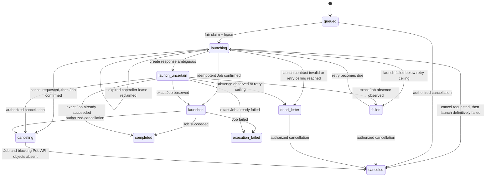

# Fair Runner Control Plane

- Status: Kubernetes lifecycle and encrypted invocation exchange executable; broker HTTP transport, runner client, manifests, and applied evidence pending
- Product: Infinite Ocean: Spyglass
- Parent: [Pooled Kubernetes and Cell Architecture](kubernetes-topology.md)

## Decision

Spyglass runs bounded asynchronous invocations in a shared cell fleet. It does not keep an application container alive for each customer. An admitted invocation becomes one durable, identifier-only queue record; a cell runner controller fairly selects it and eventually creates one hardened, ephemeral Kubernetes Job.

The scheduling policy is independent of Kubernetes. PostgreSQL owns durable admission, Account fairness, concurrency, launch leases, retries, and terminal state. A launcher adapter owns idempotent interaction with the cluster. This keeps business policy testable without a cluster and permits another execution substrate without rewriting admission semantics.

The `spyglass runner-controller` process now performs durable fair claims, idempotent Kubernetes Job creation, due-time terminal inspection, exact foreground cancellation, and exact capacity release. It intentionally has no reference Deployment yet: the production invocation broker, runner workload identity, environment-specific Kubernetes API egress, and verified runner image are not complete, so promoting a manifest would create an attractive but incomplete execution surface.

## Control record and payload boundary

`spyglass.runner_invocation_queue` contains only:

- invocation UUID;
- Account UUID;
- fixed execution-profile code;
- processing state and attempt count;
- controller lease UUID and expiry;
- deterministic Kubernetes Job name after launch;
- bounded machine error code and lifecycle timestamps.

It must never contain a prompt, tool input, model output, connector secret, browser credential, provider token, customer file, arbitrary image, arbitrary command, or customer-selected environment variable. Encrypted request/result envelopes live in the separate forced-RLS `runner_invocation_exchanges` table and are resolved through execute-only broker functions using verified invocation identity.

The runner Pod receives no cell/global database credential and no default or Kubernetes-API-audience token. It receives one explicit 600-second projected token whose audience is exactly the HTTPS broker URL. Online TokenReview plus exact Pod UID, controller Job UID, invocation/profile labels, and launch-contract checks bind that shared-ServiceAccount credential to one invocation. The runner ServiceAccount has no RBAC. See [Runner Broker Identity and Exchange Boundary](runner-broker.md).

## State machine



`failed` means the controller could not establish a Kubernetes Job and may retry. `execution_failed` means the launched workload reached a terminal unsuccessful outcome. Those meanings are intentionally distinct.

Every `launching` row has a lease and no Job name; it may also carry a cancellation timestamp while an in-flight Kubernetes call resolves. A `launch_uncertain` row has the deterministic Job name, retains its Account slot, and has not yet recorded a confirmed launch time. Every `launched` or `canceling` row has a Job name and no controller lease. A pre-launch `canceled` row deliberately has no Job name. Retryable rows have a due time. Launch-uncertain, launched, and canceling rows have a durable next-inspection time; controller replicas claim bounded due pages with `FOR UPDATE SKIP LOCKED` and advance that time before calling Kubernetes. This prevents a page of long-running Jobs from starving newer terminal Jobs and avoids every replica polling every Job. Execution-terminal rows have a completion time and no next inspection. Database constraints reject partial combinations.

## Fair scheduling

Each Account has one `runner_account_scheduling` row:

```text
weight
concurrency_limit
active_count
virtual_finish
last_dispatched_at
```

For a fresh claim, one transaction:

1. Selects an Account that has due work and available concurrency.
2. Orders eligible Accounts by virtual finish, then oldest queued work, then immutable Account ID.
3. Locks one Account with `FOR UPDATE SKIP LOCKED` so controller replicas can claim other Accounts concurrently.
4. Locks that Account's oldest due invocation.
5. Moves it to `launching`, assigns a random lease, and increments its attempt.
6. Increments Account active count and advances virtual finish by `1 / weight`.

An Account at its concurrency limit is not eligible even if it owns the oldest global invocation. This prevents one noisy Account from occupying every slot. Weight changes relative long-run share; concurrency remains the hard per-Account ceiling. A policy cannot be lowered below current active usage because the database invariant rejects it; operators must drain first.

Expired `launching` records are reclaimed before fresh work. Reclaim changes the lease and attempt but does not increment Account active count or virtual finish again. The launcher must use a deterministic Job name and treat an already-matching Job as success, which closes the crash window after Kubernetes accepted a Job but before PostgreSQL recorded `launched`.

## Capacity lifecycle

Active count is incremented exactly once on the first fresh claim. It is decremented in the same transaction that records:

- a retryable or dead-letter launch failure; or
- `completed` or `execution_failed` after launch;
- `canceled` after a requested launch definitively fails; or
- `canceled` after foreground Job deletion has reached observed API absence.

Canceling queued, retryable-failed, or dead-letter work is immediately terminal because none owns an active slot or may have crossed the Kubernetes boundary. Canceling `launching` work records intent without changing its lease: a controller must resolve the create ambiguity, then either move the confirmed Job to `canceling` or record canceled on definitive launch failure. Canceling launched work preserves the active slot until the exact Job and its known blocking dependent Pod API objects are absent.

A network failure, server `5xx`, malformed success response, or unresolved `409 AlreadyExists` after Job creation is not a launch failure. It becomes `launch_uncertain` with the deterministic Job identity and retains Account capacity. Reconciliation verifies the exact launch contract: an observed Job becomes launched (or immediately terminal), while an observed `404` alone returns the invocation to retry/dead-letter and releases capacity. This closes the crash/timeout window in which an accepted Job could otherwise run outside the concurrency count. Cancellation converts uncertain launch directly to canceling and never takes the absence shortcut without an API observation.

Completion binds both invocation UUID and Job name. A repeated identical completion is idempotent. A stale lease, different Job name, or conflicting terminal outcome fails closed. The PostgreSQL contract proves expired-lease reclaim does not double-count capacity and that a stale controller cannot fail or launch the reclaimed invocation.

The Kubernetes reconciler treats a missing launched Job as an error and keeps Account capacity allocated. A missing canceling Job is terminal evidence only after the controller issued the exact idempotent delete. Successful and failed Job conditions become `completed` and `execution_failed` for launched or launch-uncertain rows; a committed cancellation request wins and proceeds to absence. Inspection verifies the immutable invocation, profile, and launch-contract digest before trusting a Job condition.

## Database authority

The queue is a technical cross-Account control plane and is intentionally not protected by Account RLS. Its dedicated controller role receives only:

```sql
GRANT USAGE ON SCHEMA spyglass TO spyglass_runner_controller;
GRANT SELECT, UPDATE ON spyglass.runner_account_scheduling TO spyglass_runner_controller;
GRANT SELECT, UPDATE ON spyglass.runner_invocation_queue TO spyglass_runner_controller;
```

It receives no `INSERT` authority and therefore cannot manufacture runnable work. It also receives no access to Account namespaces, Work, Agents, prompts, files, entitlements, Users, sessions, Billing, or provider credentials. The integration contract runs claim/lifecycle operations through this non-owner role and proves direct reads of Account namespaces and Work, and direct queue insertion, fail.

The producer role has no table grants. Production provisioning executes `spyglass_provision_runner_invocation`, which atomically creates the identifier queue record and encrypted request. Configuration and cancellation remain separate execute-only operations; the lower-level enqueue function is retained for the controller contract but is not the production request path. These security-definer functions validate bounded input and Account identity, require an existing active namespace for new work, and preserve invocation identity idempotency. Cancellation binds both invocation and Account and remains available while an Account is frozen so erasure can drain work. The application must still provision or cancel only after current Membership, package entitlement/capability policy, budget, operation-id, and audit checks.

## Account erasure and restore

Runner control is part of cell Account erasure policy from its first migration:

- readiness and execution reject queued, launching, launch-uncertain, launched, canceling, retryable-failed, or dead-letter invocations;
- completed, execution-failed, and canceled records may be erased;
- encrypted exchange, invocation, and scheduling rows are removed before the Account namespace;
- content-free row counts are merged into the immutable tombstone before its restore-ledger root is computed;
- restore replay removes restored runner-control rows before recreating the same checkpoint.

The original erasure functions remain under internal names because applied migrations are immutable. Production grants assign both the public wrapper and internal implementation to the same `NOLOGIN NOBYPASSRLS` erasure function role; only the public wrapper is executable by the short-lived operator role.

## Kubernetes adapter contract

The executable adapter enforces these rules:

- Job name is derived only from invocation UUID.
- Digest-pinned image, command, profile-to-resources mapping, sandbox RuntimeClass, service account, deadline, and retention are operator configuration, never invocation input.
- An HTTP `409 AlreadyExists` is success only after the existing Job's immutable invocation identity matches.
- Network errors, server `5xx` responses, mismatched create responses, and unresolved conflicts preserve the deterministic name as an uncertain launch; they never release capacity as ordinary launch failures.
- Cancellation first verifies Job name, invocation/profile labels, and launch-contract digest, then sends [foreground deletion](https://kubernetes.io/docs/concepts/architecture/garbage-collection/#foreground-cascading-deletion) with exact [UID and resource-version preconditions](https://kubernetes.io/docs/reference/kubernetes-api/definitions/delete-options-v1-meta/). Only a later `404 Not Found` for a canceling invocation releases capacity; this is evidence that the Job and known blocking dependent Pod API objects are gone.
- Pods run as UID/GID 65532 with a read-only root filesystem, RuntimeDefault seccomp, no privilege escalation, all Linux capabilities dropped, bounded CPU/memory/ephemeral-storage/time, an operator-selected sandbox RuntimeClass, and no host namespaces or volumes. The RuntimeClass/admission policy must supply the tested PID and stronger sandbox boundary.
- Runner service accounts have `automountServiceAccountToken: false` and no RBAC. One read-only projected token is mounted explicitly for the broker audience; deployment must prove that audience is not accepted for direct Kubernetes API requests.
- The implemented API client needs only `create`, `get`, and `delete` on Jobs in its cell namespace; it must never gain list/watch, Secret reads, pod exec, or wildcard RBAC.
- NetworkPolicy denies all by default and allows only DNS, the invocation broker, approved model/tool egress gateways, and telemetry as required by the fixed profile.
- The controller observes Job conditions and records one terminal outcome; a missing or ambiguous launched Job remains reconcilable rather than silently releasing capacity, while a missing canceling Job is accepted only after the exact delete path.

Kubernetes API absence is not proof that a process on a partitioned node has physically stopped. The invocation broker must independently reject payload, tool-capability, and result access as soon as durable state becomes `canceling` or `canceled`. Applied node-loss tests must prove this revocation and alert on cancellation age; operators must not force-remove finalizers as a routine recovery path.

The controller process is horizontally safe. PostgreSQL `SKIP LOCKED`, launch leases, durable inspection due-times, deterministic Job names, launch-contract hashes, preconditioned deletion, and idempotent terminal transitions—not leader-local memory—coordinate replicas.

## Scaling and observability

The existing stats contract exposes bounded counts for ready, launching, launch-uncertain, launched, canceling, retryable-failed, and dead-letter invocations plus oldest-ready age. Production metrics must add launch latency, uncertainty age/resolution, cancellation latency, run duration, terminal outcome, reclaim count, admission denial reason, and Account concurrency saturation. Account identity must be omitted or represented by a controlled low-cardinality hash.

Event-driven scaling should use ready count and oldest-ready age. Controller replicas scale only within database connection and Kubernetes API budgets. Cluster autoscaling reacts to pending runner Jobs whose fixed profiles have valid resource requests. Queue depth alone never overrides Account concurrency, package limits, global safety ceilings, or provider budgets.

## Acceptance gates

- PostgreSQL 17 migration replay and checksum drift checks pass.
- Non-owner role cannot read customer tables.
- Same invocation identity is idempotent; a conflicting Account/profile is rejected.
- One Account at concurrency limit cannot block another eligible Account.
- Weighted share converges under sustained multi-Account backlog.
- Parallel controllers never exceed Account concurrency.
- Controller crash before and after Kubernetes acceptance converges to one Job.
- Ambiguous create responses retain capacity until exact Job observation or exact absence.
- Launch retry/dead-letter and every execution-terminal path release capacity exactly once.
- Queued, launching, launch-uncertain, launched, repeated, cross-Account, and stale-controller cancellation races converge without deleting a mismatched Job or releasing capacity early.
- Account erasure blocks unfinished runs and removes all terminal control records.
- Applied-cluster tests prove RBAC, NetworkPolicy, pod hardening, cancellation, node loss, API timeout, controller rollout, queue-driven scale-up, and cleanup.
- A many-small-Accounts plus one-hot-Account load test meets the admitted-start SLO without database or Kubernetes API saturation.
